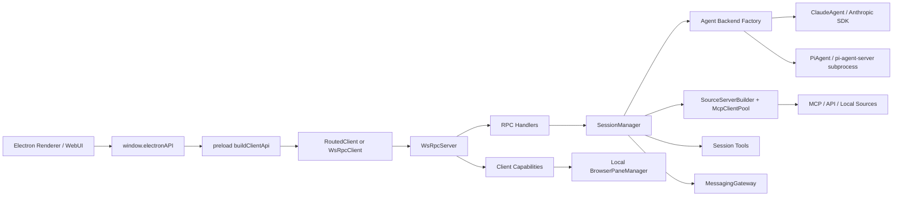
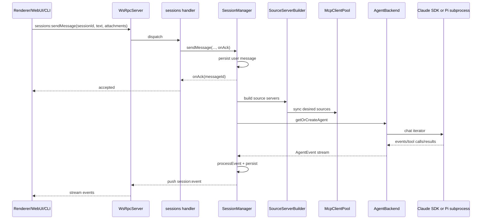

# Craft Agents OSS 0.10.3 代码分析报告

生成日期: 2026-06-16  
源码目录: `C:\Users\xiang\Desktop\trace\craft-agents-oss-0.10.3`  
分析目标: 调研当前最新版应用源码的功能模块、运行链路、存储模型和改造风险点，为后续项目改造建立基线。

> 说明: 本报告基于本地源码静态调研形成。当前目录不是 Git 仓库，未使用提交历史做辅助判断。

## 1. 总体判断

Craft Agents OSS 是一个 Bun + TypeScript monorepo。核心产品不是单一 Electron 应用，而是一套可被多种前端复用的 agent runtime:

- Electron 桌面端是主产品入口，负责窗口、本地浏览器、原生能力、自动更新、通知、深链和打包资源。
- `server-core` 提供 WebSocket RPC、headless bootstrap、RPC handlers、SessionManager、WebUI HTTP handler、模型刷新和平台抽象。
- `shared` 是最大公共包，承担 agent 后端、配置、会话存储、source/MCP、凭据、OAuth、skills、automations、protocol 等大部分业务逻辑。
- `webui` 不是独立前端重写，而是建立浏览器版 `window.electronAPI` 后复用 Electron renderer 的 `App`。
- `viewer` 是只读 session transcript 查看器，复用 `@craft-agent/ui`。
- `cli` 是轻量 WebSocket RPC 客户端，可连接已运行 server，也可临时拉起 headless server。
- Pi Agent 后端通过独立子进程 JSONL 协议运行，避免 Pi SDK/Esm/重依赖进入 Electron main bundle。
- Messaging 是独立输入输出通道，覆盖 Telegram、WhatsApp、Lark、binding、pairing、权限和 plan/permission 按钮回调。

架构主线可以概括为:



## 2. Monorepo 清单

根目录 `package.json` 使用 Bun workspaces:

- `packages/*`
- `apps/*`
- 排除 `apps/online-docs`

主要脚本:

- `bun run electron:start` / `electron:dev`: 桌面端。
- `bun run server:start` / `server:dev`: headless server。
- `bun run webui:build` / `webui:dev`: WebUI。
- `bun run viewer`: session viewer。
- `bun run typecheck:all`: 全量类型检查。
- `bun test`: 测试入口。

模块体量按 `rg --files` 粗略统计:

| 模块 | 文件数 | 主要职责 |
|---|---:|---|
| `apps/electron` | 822 | 桌面主程序、preload、renderer、browser pane、打包资源 |
| `apps/webui` | 22 | 浏览器端薄适配层，复用 Electron renderer |
| `apps/viewer` | 13 | 只读 transcript 查看器 |
| `apps/cli` | 8 | WebSocket RPC CLI 客户端和 headless server spawner |
| `packages/shared` | 434 | agent、config、sessions、sources、MCP、auth、credentials、skills、automations、protocol |
| `packages/server-core` | 95 | bootstrap、transport、handlers、SessionManager、WebUI、services |
| `packages/ui` | 180 | 跨 Electron/viewer 复用的 React UI、markdown、overlay、chat 组件 |
| `packages/messaging-gateway` | 49 | Telegram/WhatsApp/Lark 网关、binding、pairing、renderer |
| `packages/pi-agent-server` | 30 | Pi SDK 子进程 JSONL server |
| `packages/session-tools-core` | 47 | session scoped tools 定义和执行上下文 |
| `packages/messaging-whatsapp-worker` | 10 | Baileys WhatsApp Node 子进程 |
| `packages/core` | 14 | 核心 types/utils 导出 |
| `packages/server` | 4 | standalone headless server 入口 |
| `packages/session-mcp-server` | 3 | session tools stdio MCP server |

测试面: 约 346 个 `*.test.ts` / `*.test.tsx` 文件，重点覆盖 transport、agent backend、SessionManager、MCP/source、automations、messaging、UI markdown/annotation、CLI 和 WebUI/server。

## 3. 应用层模块

### 3.1 `apps/electron`

关键目录:

- `src/main`: Electron main process。负责 app lifecycle、窗口、菜单、通知、自动更新、deep link、平台服务、server bootstrap。
- `src/preload`: preload bootstrap。建立 WebSocket/RoutedClient，暴露 `window.electronAPI`。
- `src/renderer`: React UI。包含 AppShell、session list/chat、settings、sources、skills、automations、messaging、browser UI。
- `src/transport`: renderer 到 server 的 channel map、client API 构造、路由客户端。
- `src/shared`: Electron renderer/main 共享类型。
- `src/runtime`: 平台服务抽象相关。

#### Main process

入口: `apps/electron/src/main/index.ts`

主要职责:

- 最早加载 shell 环境，保证 Homebrew/nvm 等 PATH 对 agent 可见。
- 初始化 Sentry，并对 token、API key、password、authorization 等敏感字段做 scrub。
- 初始化 i18n，主进程语言从 persisted `uiLanguage` 恢复。
- 配置打包资源路径和 runtime env:
  - `CRAFT_UV`
  - `CRAFT_SCRIPTS`
  - `CRAFT_BUN`
  - `CRAFT_AGENT_VERSION`
  - document/tool scripts PATH
- 注册 Pi model resolver，避免 renderer 直接 import Pi SDK。
- 注册 `agentpi://` deep link；旧 `craftagents://` 仅作为历史版本上下文保留，不再是本开发版默认协议。
- 初始化 `WindowManager`、`BrowserPaneManager`、`SessionManager`、`OAuthFlowStore`、model refresh service、messaging bootstrap。
- 通过 `bootstrapServer` 启动本地 WsRpcServer。即使是桌面本地模式，也走 WebSocket RPC。
- 支持 headless 模式，打印 `CRAFT_SERVER_URL` / `CRAFT_SERVER_TOKEN`。
- 初始化 credential health check、power manager、auto-update、window state restore。
- 退出前 flush sessions、销毁 browser pane、dispose OAuth store、停止 model refresh、停止 messaging gateway、释放 server lock。

核心设计点:

- Electron 本地模式和 headless server 共享 `server-core/bootstrap`。
- Main process 只注入平台能力，业务逻辑尽量下沉到 `server-core` / `shared`。
- 本地 UI 事件也改用 RPC event sink，减少旧 IPC 与新 WS transport 的双轨。

#### Preload 和 RPC API

入口: `apps/electron/src/preload/bootstrap.ts`

职责:

- Thin-client 模式: 如果存在 `CRAFT_SERVER_URL`，创建单个远程 `WsRpcClient`。
- 正常桌面模式: 创建本地 `WsRpcClient`，如果当前 workspace 是 remote，再创建 remote workspace client，并用 `RoutedClient` 分流。
- 注册 client capabilities:
  - `client:openExternal`
  - `client:openPath`
  - `client:showItemInFolder`
  - `client:confirmDialog`
  - `client:openFileDialog`
  - `client:browser:invoke`
- 使用 `buildClientApi(CHANNEL_MAP)` 生成 `window.electronAPI`。
- OAuth flow 由 client 侧编排，因为 callback server 和打开浏览器必须发生在用户机器上。

`apps/electron/src/transport/channel-map.ts` 是 renderer API 到 wire channel 的集中映射。它覆盖:

- sessions/tasks
- workspaces/window
- files/fs
- auth/onboarding/OAuth/LLM connections
- sources/skills/statuses/labels/views
- theme/notifications/input/power/update/menu
- browser pane
- automations/resources/messaging

`packages/shared/src/protocol/routing.ts` 将 channel 分成:

- `LOCAL_ONLY`: 必须在本地 Electron 执行，如窗口、native dialog、shell open、browserPane、auto-update、OS theme、local workspace CRUD。
- `REMOTE_ELIGIBLE`: 跟 workspace 所属 server 走，如 sessions、sources、skills、LLM connections、automations、messaging、workspace files。

这是远程 workspace / thin client 改造时最重要的边界。

#### WindowManager

文件: `apps/electron/src/main/window-manager.ts`

职责:

- 创建/管理 BrowserWindow。
- 记录 `webContents.id -> workspaceId`。
- 支持 focused mode、多窗口标题策略、窗口状态保存。
- 拦截外部 URL / internal deep link，调用 url safety 分类。
- 对 renderer 事件优先通过 RPC event sink 推送到特定 client，握手前才 fallback 到 `webContents.send`。

#### BrowserPaneManager

文件: `apps/electron/src/main/browser-pane-manager.ts`

职责:

- 用独立 BrowserWindow/BrowserView 管理可自动化浏览器实例。
- 每个 instance 有 toolbar view、page view、native overlay、CDP 控制器。
- 维护 currentUrl/title/favicon/loading/back/forward/boundSessionId/workspaceId/owner 等状态。
- 支持 CDP snapshot、click、fill、select、screenshot、evaluate、scroll、console/network/download logs。
- 通过 `CLIENT_BROWSER_INVOKE` capability 暴露给远程 server，使远程 agent 能驱动本地浏览器。
- 有远程 evaluate 开关 `allowRemoteEvaluate`。

改造风险:

- Browser pane 是 local-only，但 agent 运行可能在 remote server。任何浏览器工具改动都要考虑 capability 反向调用。
- Screenshot、accessibility snapshot、network idle 等逻辑与 UI/agent tool output 都有关联。

#### Renderer

入口: `apps/electron/src/renderer/App.tsx`

主要结构:

- `App.tsx`: 顶层状态机和数据装配。状态包括 `loading`、`onboarding`、`reauth`、`workspace-picker`、`ready`。
- `components/app-shell`: 主工作台，包含左侧 workspace/session/filter、主聊天、面板栈、输入区、settings 导航入口等。
- `atoms`: 使用 Jotai 管理 session、sources、skills、automations、browser pane、panel stack。
- `event-processor`: 纯函数处理 agent event，输出新 session state 和 effects。
- `hooks`: session loading、transport recovery、notifications、onboarding、labels/statuses/views、workspace icon、update checker。
- `pages/settings`: 设置页。
- `components/messaging`, `components/automations`, `components/sources`, `components/skills`: 业务 UI。
- `playground`: 组件和交互预览。

重要状态设计:

- `atoms/sessions.ts` 不再保存一个带所有 messages 的 `sessionsAtom`，而是:
  - `sessionMetaMapAtom`: session list 轻量元数据。
  - `sessionAtomFamily(id)`: 单 session 全量数据。
  - `loadedSessionsAtom`: 记录 messages 是否懒加载。
- 这样避免大量历史 session 导致内存膨胀和跨 session streaming re-render。

事件处理:

- `event-processor/processor.ts` 是 renderer 侧 agent event 的单一纯函数入口。
- 覆盖 `text_delta`、`tool_start`、`tool_result`、`complete`、`error`、`permission_request`、`credential_request`、`plan_submitted`、`sources_changed`、`labels_changed`、usage 等。
- `source_activated` 已转为 server-side auto retry，renderer 只做 UI feedback。

### 3.2 `apps/webui`

入口:

- `apps/webui/src/main.tsx`
- `apps/webui/src/App.tsx`
- `apps/webui/src/adapter/web-api.ts`

设计:

- 启动时先请求 `/api/config` 获取 WebSocket URL。
- 若 URL 没有 workspace 参数，再请求 `/api/config/workspaces` 获取默认 workspace。
- 创建浏览器版 `WsRpcClient`，使用 cookie auth，不传 bearer token。
- 通过同一套 `buildClientApi` + `CHANNEL_MAP` 生成 `window.electronAPI`。
- 对 Electron-only API 做 web override:
  - native file dialog -> browser file input。
  - shell open -> `openExternalUrl`。
  - window/menu/badge/update/power 等 -> no-op 或 browser 等价实现。
  - OAuth -> server 准备 flow，WebUI 打开新 tab 或同窗口 fallback。
- 最后 lazy load Electron renderer `App`。

结论: WebUI 的核心策略是“适配 ElectronAPI，而不是重写业务 UI”。后续改造 UI 时要注意 Electron/WebUI 双端兼容。

### 3.3 `apps/viewer`

入口: `apps/viewer/src/App.tsx`

职责:

- 只读查看 session transcript。
- 路由:
  - `/`: 上传 session JSON。
  - `/s/{id}`: 从 `/s/api/{id}` 加载共享 session。
- 复用 `@craft-agent/ui` 的 `SessionViewer`、overlays、markdown、diff/code/terminal/json/document preview。
- 平台能力很少，只提供打开 URL、复制到剪贴板等 browser-safe 操作。

用途:

- share-to-viewer 功能的展示端。
- 也是 `packages/ui` 可复用性的验证入口。

### 3.4 `apps/cli`

入口:

- `apps/cli/src/index.ts`
- `apps/cli/src/client.ts`
- `apps/cli/src/server-spawner.ts`

职责:

- 通过 WebSocket 连接 Craft server。
- 支持 env fallback:
  - `CRAFT_SERVER_URL`
  - `CRAFT_SERVER_TOKEN`
  - `CRAFT_TLS_CA`
  - `LLM_PROVIDER`
  - `LLM_MODEL`
  - `LLM_API_KEY`
  - `LLM_BASE_URL`
- 命令包括 ping、health、versions、workspaces、sessions、run/send 等。
- `CliRpcClient` 是简化版 WsRpcClient: 无自动重连、无 capability、请求-响应后退出。
- `server-spawner.ts` 可启动 headless server，读取 stdout 中的 `CRAFT_SERVER_URL=` 和 `CRAFT_SERVER_TOKEN=`。

改造影响:

- 新增/修改 server RPC 后，如果想给 CLI 使用，需要同步 command parser 和输出格式。
- CLI 是验证 headless server 能否独立工作的低成本入口。

## 4. Server 与 Transport

### 4.1 `packages/server`

入口: `packages/server/src/index.ts`

这是 standalone headless server:

- 要求 `CRAFT_SERVER_TOKEN`。
- 支持 `CRAFT_RPC_HOST` / `CRAFT_RPC_PORT`。
- 支持 TLS:
  - `CRAFT_RPC_TLS_CERT`
  - `CRAFT_RPC_TLS_KEY`
  - `CRAFT_RPC_TLS_CA`
- 支持 WebUI:
  - `CRAFT_WEBUI_DIR`
  - `CRAFT_WEBUI_PASSWORD`
  - `CRAFT_WEBUI_SECURE_COOKIE`
  - `CRAFT_WEBUI_WS_URL`
- 支持 WhatsApp worker:
  - `CRAFT_MESSAGING_WA_WORKER`
  - `CRAFT_MESSAGING_NODE_BIN`
- 通过 `bootstrapServer` 创建 `SessionManager`、handlers、OAuth store、model refresh、messaging。
- 如果绑定非 localhost 且未启用 TLS，默认拒绝启动，除非传 `--allow-insecure-bind`。
- 可用 `--generate-token` 输出随机 server token。

### 4.2 `packages/server-core/bootstrap`

核心: `packages/server-core/src/bootstrap/headless-start.ts`

`bootstrapServer<TSessionManager,THandlerDeps>` 是 Electron main 和 headless server 共同使用的启动器。

职责:

- 校验 `CRAFT_SERVER_TOKEN` 和 token entropy。
- 初始化 config dir/global config。
- 创建 server lock file，处理 stale PID。
- 创建 `WsRpcServer`，配置 host/port/tls/http handler/auth。
- 创建 `OAuthFlowStore`。
- 创建并绑定 `SessionManager`。
- 创建 HandlerDeps，注册 RPC handlers。
- 设置 session event sink。
- 初始化 SessionManager。
- 启动 model refresh。
- 返回 stop handle，停止时推送 `server:shuttingDown`、停止 refresh、cleanup session manager、关闭 WS、dispose OAuth store、释放 lock。

这是后续抽离 server/runtime 的关键缝合点。

### 4.3 WebSocket RPC

核心文件:

- `packages/server-core/src/transport/server.ts`
- `packages/server-core/src/transport/client.ts`
- `packages/server-core/src/transport/capabilities.ts`
- `packages/shared/src/protocol/channels.ts`
- `packages/shared/src/protocol/routing.ts`
- `apps/electron/src/transport/channel-map.ts`
- `apps/electron/src/transport/routed-client.ts`

Server 特性:

- WebSocket handshake 校验 protocol version。
- 支持 bearer token 和 WebUI session cookie auth。
- 支持 client capabilities。
- 支持 heartbeat。
- 请求 handler 有超时保护。
- server push 支持 target:
  - all
  - workspace
  - client
- per-client event buffer 和 reconnect replay。
- 可由 server invoke client capability。
- 可嵌入 WebUI HTTP handler，共用端口。

Client 特性:

- 自动重连和 backoff。
- request correlation。
- event listeners。
- capability handlers。
- connection state model。
- `__transport:reconnected` 供 renderer 恢复 stale session metadata。

RoutedClient:

- Local-only channels 始终走本地 server。
- Remote-eligible channels 走 workspace owner server。
- workspace switch 后替换 workspace client，并重订阅 remote listeners。
- 远程 workspace 会把本地 workspace ID 翻译为 remote workspace ID。

改造风险:

- 增加新 RPC channel 必须同步:
  1. `RPC_CHANNELS`
  2. `protocol/routing.ts`
  3. `channel-map.ts`
  4. server handler registration
  5. ElectronAPI 类型
  6. WebUI override 如有 local-only 行为
- `protocol/routing.ts` 有 exhaustiveness 测试，新增 channel 未分类会失败。

### 4.4 RPC Handlers

入口: `packages/server-core/src/handlers/rpc/index.ts`

分组:

- `auth`
- `automations`
- `files`
- `labels`
- `llm-connections`
- `oauth`
- `resources`
- `onboarding`
- `sessions`
- `server`
- `settings`
- `skills`
- `sources`
- `statuses`
- `system`
- `transfer`
- `workspace`
- `messaging`

`HandlerDeps` 是 handler 的依赖容器:

- `sessionManager`
- `platform`
- `windowManager`
- `browserPaneManager`
- `oauthFlowStore`
- `messagingRegistry`

典型 handler:

- `sessions.ts`: session CRUD、send message、cancel、kill shell、permission/credential response、session commands、file watch、export/import。
- `sources.ts`: source CRUD、source credential、permissions、MCP tools 查询。
- `llm-connections.ts`: LLM connection 设置、测试、OAuth/Copilot/ChatGPT auth、model refresh。
- `messaging.ts`: messaging config/binding/pairing/WhatsApp connect/access control。

### 4.5 WebUI HTTP Handler

文件:

- `packages/server-core/src/webui/http-server.ts`
- `packages/server-core/src/webui/auth.ts`

职责:

- 提供 web-standard `fetch(Request) => Response` handler，可嵌入 WS server，也可 standalone Bun.serve。
- 登录页、静态资源、SPA fallback。
- `/health`
- `/api/auth` 登录，使用 Bun argon2id password hash。
- `craft_session` HttpOnly, SameSite=Strict cookie。
- JWT 使用 `jose` HS256，24 小时过期。
- per-IP + global sliding window rate limiter。
- `/api/config` 返回 browser-facing WS URL。
- `/api/config/workspaces` 返回默认 workspace。
- `/api/oauth/callback` 完成 source OAuth token exchange 并推送 sources changed。

安全注意:

- `trustedProxies` 未配置时不信任 `x-forwarded-for`，rate limit key 为 `direct`。
- Secure cookie 默认根据 request/proxy proto 推断，也可显式覆盖。

## 5. SessionManager 与会话系统

### 5.1 SessionManager

文件: `packages/server-core/src/sessions/SessionManager.ts`

这是当前系统耦合最高的类，承担:

- 初始化 workspace/session。
- 从磁盘加载 session metadata。
- 管理 config watcher。
- 管理 SessionPersistenceQueue。
- 创建/删除/rename/archive/flag/read/unread/session status/labels。
- 创建和缓存 AgentBackend。
- 管理 sendMessage 主流程。
- 管理 permission/credential/auth request。
- 管理 source activation 和自动 retry。
- 管理 browser tool ownership。
- 管理 branch/transfer/share。
- 管理 automations。
- 推送 session events。
- 处理 remote browser pane fallback。
- flush/cleanup。

关键设计:

- session list 默认只加载 metadata，messages 在打开 session 时懒加载。
- `sendMessage` 在实际模型流式输出前先持久化 user message 并 ack，避免中途 crash 丢用户消息。
- Agent backend 按 session 创建/缓存，runtime 配置变更可 refresh。
- source server 构建失败不一定阻断 UI active state，SourceManager 会区分 intended active 和 actual active。
- source inactive tool error 可触发 server-side auto activation，然后自动 retry 下一轮。
- branch 不只是复制 UI messages，还会保存 provider-native anchor:
  - Claude: `claude-turn-anchors.json`
  - Pi: `pi-turn-anchors.json`
- 远程 server 没有本地 browser manager 时，可通过 RPC server 查找 desktop host client 并用 `RemoteBrowserPaneManager` 反向调用本地浏览器。

改造建议:

- 不建议在当前 `SessionManager` 上继续堆新功能。
- 优先抽出以下 service:
  - `SessionLifecycleService`
  - `AgentRuntimeService`
  - `SessionPersistenceService`
  - `SourceActivationService`
  - `AutomationBindingService`
  - `ShareTransferService`
  - `BrowserOwnershipService`

### 5.2 Session 存储

文件:

- `packages/shared/src/sessions/storage.ts`
- `packages/shared/src/sessions/jsonl.ts`
- `packages/shared/src/sessions/types.ts`

目录结构:

```text
{workspaceRoot}/sessions/{sessionId}/
  session.jsonl
  plans/
  attachments/
  long_responses/
  data/
  downloads/
```

`session.jsonl`:

- 第一行是 header/metadata。
- 后续每行是 message。
- header 可快速读取以支撑 session list。
- 写入使用 temp + rename 的原子写策略，Windows 下先删除目标再 rename。
- 路径支持 portable token `{{SESSION_PATH}}`。
- message 解析对损坏行尽量跳过。

Header 预计算:

- message count
- preview
- last role
- token usage
- last final assistant message
- read/unread fields

Session metadata 主要字段:

- workspace/session identity
- timestamps
- name/preview/read/unread
- source slugs
- permission mode
- working directory
- model/connection/thinking
- share info
- branch metadata
- transfer summary
- pending plan execution
- automation origin
- labels/status/archive/flag

### 5.3 会话发送消息流程



关键点:

- RPC sendMessage 返回仅代表 user message 已持久化和接受，不代表模型完成。
- 后续 complete/error/interrupted 都走 `session:event`。
- post-persist 错误会推送给调用 client。
- 这条链路上任何异常处理都要区分“用户消息是否已经 ack”。

## 6. Agent 后端

### 6.1 Backend Factory

文件:

- `packages/shared/src/agent/backend/types.ts`
- `packages/shared/src/agent/backend/factory.ts`
- `packages/shared/src/agent/backend/internal/runtime-resolver.ts`
- `packages/shared/src/agent/backend/internal/drivers/anthropic.ts`
- `packages/shared/src/agent/backend/internal/drivers/pi.ts`

`AgentBackend` 接口提供:

- `chat`
- `abort` / `forceAbort`
- `interruptForHandoff`
- `redirect`
- `runMiniCompletion`
- `queryLlm`
- `destroy`
- `postInit`
- `applyBridgeUpdates`
- `ensureBranchReady`
- model/thinking/permission/source 状态更新
- permission/auth/session callbacks

支持 provider:

- `anthropic` -> `ClaudeAgent`
- `pi` / `pi_compat` -> `PiAgent`

连接选择顺序:

1. session connection override。
2. workspace default connection。
3. global default connection。

Runtime resolver:

- 解析 Claude SDK native binary。
- 解析 Pi server bundle。
- 解析 network interceptor bundle。
- 解析 session MCP server。
- 解析 bundled Bun / Node runtime。
- 解析 ripgrep。

### 6.2 BaseAgent

文件: `packages/shared/src/agent/base-agent.ts`

这是 Claude/Pi 的公共父类，负责:

- PermissionManager。
- SourceManager。
- PromptBuilder。
- PathProcessor。
- ConfigWatcherManager。
- UsageTracker。
- PrerequisiteManager。
- skill mention 解析和 SKILL.md 必读前置。
- source guide 必读前置。
- branch/transfer context 注入。
- source activation restart 状态。
- session tool completion。
- title generation。
- spawn_session。
- call_llm 预处理。

### 6.3 PromptBuilder

文件: `packages/shared/src/agent/core/prompt-builder.ts`

职责:

- 把 volatile context 和 stable context 分开，以提升 prompt cache 命中。
- 注入日期/时间、session state、source state、workspace capabilities、working dir。
- 一次性 permission-mode signal 只消费一次。
- 支持 recovery context、pinned preferences。

### 6.4 PermissionManager

文件: `packages/shared/src/agent/core/permission-manager.ts`

职责:

- 根据当前 permission mode 检查 tool call。
- 代理 `mode-manager` 的复杂规则。
- 检查 Bash read-only pattern。
- 检查 API endpoint allowlist。
- 管理 session-scoped always allow commands/domains。
- `ask` 模式下危险命令仍需要用户确认。

危险命令包括:

- `rm`, `rmdir`, `sudo`, `chmod`, `chown`, `mv`, `cp`, `dd`
- `kill`, `reboot`, `shutdown`
- `curl`, `wget`, `ssh`, `scp`, `rsync`
- `git push`, `git reset`, `git rebase`, `git checkout`

### 6.5 PrerequisiteManager

文件: `packages/shared/src/agent/core/prerequisite-manager.ts`

职责:

- 阻止 tool 使用，直到必要文件已被 Read 或 Bash cat/sed/head/tail 读取。
- MCP source 工具使用前要求读 `{workspace}/sources/{slug}/guide.md`。
- browser_tool 使用前要求读 `~/.agent-pi/docs/browser-tools.md`。
- skill mention 后要求读对应 `SKILL.md`。
- compaction 后重置 read state。

这是当前产品避免“source/skill 未读说明就乱用工具”的核心机制。

### 6.6 SourceManager

文件: `packages/shared/src/agent/core/source-manager.ts`

职责:

- 维护 active、intended active、all sources。
- 生成 `<sources>` XML 上下文注入。
- 区分 active 但无工具、needs_auth、failed。
- 提示 guide.md 必读。
- 识别 inactive source tool error，返回可自动激活的 source slug。
- 根据 source 类型推断 auth tool:
  - OAuth -> `source_oauth_trigger`
  - bearer/API key -> `source_credential_prompt`

### 6.7 ClaudeAgent

文件:

- `packages/shared/src/agent/claude-agent.ts`
- `packages/shared/src/agent/backend/claude/event-adapter.ts`

职责:

- 使用 `@anthropic-ai/claude-agent-sdk` 的 `query`、`createSdkMcpServer`、`tool`。
- 构造 Claude SDK options。
- 注入 auth。
- 内置 session tools。
- PreToolUse 权限检查。
- 处理 image/document attachments。
- 支持 AbortController abort。
- 支持 native branch `ensureBranchReady`。
- 支持 mini completion 和 `queryLlm`。

Event adapter:

- 将 Claude SDK 消息映射为 Craft `AgentEvent`。
- 维护 tool index、pending text、active parent tools、usage snapshots。
- 将 read-like shell command 映射为更友好的 Read tool UI。

### 6.8 PiAgent 与 pi-agent-server

文件:

- `packages/shared/src/agent/pi-agent.ts`
- `packages/shared/src/agent/backend/pi/event-adapter.ts`
- `packages/pi-agent-server/src/index.ts`

设计:

- 主进程 `PiAgent` spawn `pi-agent-server` 子进程。
- 使用 stdin/stdout JSONL 协议。
- 子进程内封装 `@mariozechner/pi-coding-agent` 和 `@mariozechner/pi-ai`。
- 这样隔离 Pi SDK ESM、heavy deps 和 Electron bundling 问题。

JSONL 消息类型包括:

- init
- prompt
- register_tools
- tool_execute_response
- pre_tool_use_response
- abort
- mini_completion
- llm_query
- ensure_session_ready
- set_model
- set_thinking_level
- compact
- set_auto_compaction
- update_runtime_config
- steer
- token_update
- shutdown

主进程 `PiAgent` 管理:

- ready/init。
- event queue。
- permission/tool/mini/LLM/branch/runtime-update pending maps。
- stderr ring buffer。
- token refresh。
- session tool context。
- backend session tools:
  - `call_llm`
  - `spawn_session`
  - `browser_tool`
- `SESSION_TOOL_REGISTRY` registry tools。

Pi event adapter:

- 映射 message_update/end、tool execution、agent_end、compaction、auto_retry、queue_update、`pi_turn_anchor`。
- 有 overflow recovery 状态机，处理 SDK auto-compaction 期间 queue open 状态。

改造风险:

- Pi 相关改动一般要同时改:
  1. `PiAgent` 主进程协议客户端。
  2. `pi-agent-server` 子进程协议和 SDK 调用。
  3. Pi event adapter。
  4. session-tool parity tests。

## 7. Source、MCP 与 Session Tools

### 7.1 Source 模型

文件:

- `packages/shared/src/sources/types.ts`
- `packages/shared/src/sources/storage.ts`
- `packages/shared/src/sources/server-builder.ts`

Source 类型:

- `mcp`
- `api`
- `local`

MCP auth:

- `oauth`
- `bearer`
- `none`

API auth:

- `bearer`
- `header`
- `query`
- `basic`
- `oauth`
- `none`

目录结构:

```text
{workspaceRoot}/sources/{slug}/
  config.json
  guide.md
  icon.*
  permissions.json
```

`storage.ts` 负责:

- source CRUD。
- config/guide/icon 读取。
- builtin source merge。
- slug 生成。
- source usable 判断。
- credential orphan cleanup。

`SourceServerBuilder` 负责:

- 把 LoadedSource + credentials 转换为 Claude/Pi 可用 server config。
- 支持 stdio/http/sse MCP。
- 支持 API source 转 in-process MCP server。
- headers 合并优先级:
  1. static headers
  2. stored headers
  3. bearer token
- OAuth/API token 可按请求读取，避免 credential 更新后必须重启。
- 返回 `mcpServers`、`apiServers`、`errors`。

### 7.2 McpClientPool

文件: `packages/shared/src/mcp/mcp-pool.ts`

职责:

- 主进程持有所有 source 连接。
- source 工具代理名为 `mcp__{slug}__{toolName}`。
- 支持 MCP server 和 in-process API server。
- sync desired sources，处理 auth/url 变更后的 reconnect。
- local MCP disabled 时过滤 stdio。
- call tools。
- 保存二进制内容到 downloads。
- 大响应进入 summarization guard。

改造影响:

- source 工具名格式被 SourceManager、permission、prerequisite、UI tool parser、event adapter 依赖。
- 不宜轻易改变 `mcp__{slug}__{tool}` 命名规则。

### 7.3 Session Tools

文件:

- `packages/session-tools-core/src/tool-defs.ts`
- `packages/session-tools-core/src/context.ts`
- `packages/session-mcp-server/src/index.ts`

`tool-defs.ts` 是 session-scoped tool registry，包含:

- `SubmitPlan`
- `config_validate`
- `skill_validate`
- `mermaid_validate`
- `source_test`
- source OAuth / credential tools
- `update_user_preferences`
- `transform_data`
- `script_sandbox`
- `render_template`
- `send_developer_feedback`
- backend tools:
  - `call_llm`
  - `spawn_session`
  - `browser_tool`
- session self-management:
  - `set_session_labels`
  - `set_session_status`
  - `get_session_info`
  - `list_sessions`
  - `send_agent_message`
- messaging tools。

每个 tool 标记:

- `executionMode`: registry 或 backend。
- `safeMode`: allow/block。
- 输入 schema 可转换为 MCP/Pi JSON schema。

`session-mcp-server`:

- 提供 stdio MCP server。
- 接收 `--session-id --workspace-root --plans-folder [--callback-port]`。
- 用 stderr `__CALLBACK__` 传 callback 消息。
- 可代理 docs MCP。
- `call_llm` / `spawn_session` 可通过预计算结果或 HTTP callback。

## 8. 配置、凭据、Auth、Workspace

### 8.1 Workspace 存储

文件: `packages/shared/src/workspaces/storage.ts`

默认目录: `~/.agent-pi/workspaces/`

Workspace 结构:

```text
{workspaceRoot}/
  config.json
  sources/
  sessions/
  skills/
  statuses/config.json
  statuses/icons/
  labels/config.json
  permissions.json
  automations.json
```

创建 workspace 时:

- 创建 sources/sessions/skills。
- 保存 workspace config。
- 初始化 status config 和 icons。
- 初始化 label config。
- 初始化 plugin manifest 供 SDK skills/commands/agents 使用。

### 8.2 全局配置

文件: `packages/shared/src/config/storage.ts`

全局配置: `~/.agent-pi/config.json`

主要字段:

- `llmConnections`
- `defaultLlmConnection`
- `defaultThinkingLevel`
- `workspaces`
- `activeWorkspaceId`
- `activeSessionId`
- notification/input/power/tool/browser/cache/rtk/proxy/theme/server config
- migrationsApplied

`config-defaults.json` 每次启动从 bundled assets 同步，缺失时使用 fallback。

### 8.3 ConfigWatcher

文件: `packages/shared/src/config/watcher.ts`

监听:

- `~/.agent-pi/config.json`
- `~/.agent-pi/preferences.json`
- `~/.agent-pi/theme.json`
- `~/.agent-pi/themes/*.json`
- workspace recursive:
  - sources config/guide/permissions
  - skills `SKILL.md`/icon
  - sessions `session.jsonl` header metadata
  - permissions
  - statuses/labels
  - automations

特性:

- debounce。
- Windows session metadata 更长 debounce。
- duplicate recursive watcher 检测，避免 Linux/Bun event loop 问题。
- 新目录 watch 问题用 `notifyFileChange` workaround。

### 8.4 Credentials

文件:

- `packages/shared/src/credentials/manager.ts`
- `packages/shared/src/credentials/backends/secure-storage.ts`
- `packages/shared/src/credentials/backends/env.ts`

CredentialManager:

- 当前主要使用 `SecureStorageBackend`。
- 自动初始化，支持 sync init 以适配同步清理路径。
- 提供统一 `get/set/delete/list/checkHealth`。
- 支持:
  - Anthropic API key。
  - Claude OAuth。
  - workspace OAuth。
  - source OAuth/bearer/basic/header/query。
  - LLM API key/OAuth/IAM。
- 启动时可做 credential health check。

安全建议:

- 不要把 credential 写进 config/source config。
- source/LLM 配置文件只保存连接元数据，secret 必须走 CredentialManager。

### 8.5 Auth/OAuth

目录: `packages/shared/src/auth`

支持:

- Claude OAuth。
- ChatGPT OAuth。
- Google/Slack/Microsoft/generic OAuth。
- PKCE。
- callback server/page。
- OAuthFlowStore。
- OAuth relay。
- token state/refresh。

Electron source OAuth:

- client 启本地 callback server。
- server 生成 auth URL/PKCE/state。
- client 打开浏览器。
- callback server 收 redirect。
- client 调 server complete。

WebUI source OAuth:

- server 准备 flow。
- browser 打开新 tab。
- OAuth redirect 到 `/api/oauth/callback`。
- server 完成 token exchange。
- WS push 更新 sources/auth 状态。

## 9. Automations

目录: `packages/shared/src/automations`

核心:

- `automation-system.ts`
- `types.ts`
- `event-bus.ts`
- `handlers/prompt-handler.ts`
- `handlers/webhook-handler.ts`
- `handlers/event-log-handler.ts`
- `cron-matcher.ts`
- `conditions.ts`
- `history-store.ts`

Automation events:

- App events:
  - `LabelAdd`
  - `LabelRemove`
  - `LabelConfigChange`
  - `PermissionModeChange`
  - `FlagChange`
  - `SessionStatusChange`
  - `SchedulerTick`
- Agent events:
  - `PreToolUse`
  - `PostToolUse`
  - `PostToolUseFailure`
  - `Notification`
  - `UserPromptSubmit`
  - `SessionStart`
  - `SessionEnd`
  - `Stop`
  - `SubagentStart`
  - `SubagentStop`
  - `PreCompact`
  - `PermissionRequest`
  - `Setup`

Actions:

- `prompt`: 创建/发送 prompt，可指定 connection/model/thinking/permission/labels。
- `webhook`: HTTP 请求，支持方法、headers、body、basic/bearer auth、response capture。

`AutomationSystem`:

- 每 workspace 一个实例。
- 读取并校验 `automations.json`。
- 自动 backfill matcher id。
- 启动 scheduler。
- 注册 prompt/webhook/event-log handlers。
- 维护 session metadata snapshot，用于 diff。
- 启动时 compact automation history。

改造风险:

- Automations 与 SessionManager、MessagingGateway 有交叉。特别是 Telegram topic-bound automation session 通过 registry binder hook 实现，避免包级循环依赖。

## 10. Skills、Labels、Statuses

### 10.1 Skills

文件: `packages/shared/src/skills/storage.ts`

技能来源优先级:

1. global: `~/.agents/skills`
2. workspace: `{workspace}/skills`
3. project: `{projectRoot}/.agents/skills`

同 slug 后者覆盖前者。

Skill 文件:

- `{skillDir}/SKILL.md`
- frontmatter 必须有 `name` 和 `description`
- 可选:
  - `globs`
  - `alwaysAllow`
  - `icon`
  - `requiredSources`

缓存:

- `loadAllSkills` 按 workspaceRoot/projectRoot 缓存 5 分钟。
- working dir 或 skill 文件变更时 invalidate。

### 10.2 Labels

文件: `packages/shared/src/labels/storage.ts`

路径: `{workspaceRoot}/labels/config.json`

特点:

- nested tree。
- 默认 Development/Content 两组和 `Priority`、`Project` valued labels。
- 支持颜色迁移。
- label ID 是 slug。

### 10.3 Statuses

文件: `packages/shared/src/statuses/storage.ts`

路径:

- `{workspaceRoot}/statuses/config.json`
- `{workspaceRoot}/statuses/icons/{id}.svg`

默认状态:

- `backlog`
- `todo`
- `needs-review`
- `done`
- `cancelled`

固定状态:

- `todo`
- `done`
- `cancelled`

支持 icon 文件、emoji、URL icon 下载。

## 11. Messaging

### 11.1 Gateway 结构

包: `packages/messaging-gateway`

核心文件:

- `gateway.ts`
- `registry.ts`
- `bootstrap.ts`
- `router.ts`
- `commands.ts`
- `renderer.ts`
- `binding-store.ts`
- `config-store.ts`
- `pairing.ts`
- `pending-senders.ts`
- `plan-tokens.ts`
- adapters:
  - Telegram
  - WhatsApp
  - Lark

`createMessagingBootstrap` 是 Electron 和 standalone server 的共同入口，负责:

- 创建 `MessagingGatewayRegistry`。
- 将 registry 注入 HandlerDeps。
- 用 `createFanOutSink` 包装 session event sink。
- bootstrap 后绑定 WS publisher。
- 初始化 workspace gateways。
- dispose 停止所有 gateway。

### 11.2 Registry

文件: `packages/messaging-gateway/src/registry.ts`

职责:

- 每 workspace 一个 `MessagingGateway`。
- 管理 `MessagingConfig`。
- 管理 platform adapter lifecycle。
- 管理 pairing code。
- 管理 Telegram workspace supergroup/topic。
- 管理 runtime status 并推送 UI。
- 通过 CredentialManager 保存平台 credential。
- 安装 automation binder hook，把 automation session 绑定到 Telegram topic。

### 11.3 Gateway/Router/Commands

`gateway.ts`:

- 管理 adapters。
- 管理 binding store、pending store、commands、router、renderer。
- 跟踪 plan message、permission message、pending compact accepts。
- Button press 处理 plan approval/permission approve deny。
- 访问控制按 workspace config 动态读取，配置修改无需重启。

`router.ts`:

- 根据 platform/channel/thread 找 binding。
- 已绑定则检查 access control，然后把 incoming message 转到 `SessionManager.sendMessage`。
- 附件通过 `readFileAttachment` 转 `FileAttachment`。
- 未绑定则交给 `Commands`。

`commands.ts`:

- 支持:
  - `/new`
  - `/bind`
  - `/pair`
  - `/unbind`
  - `/help`
  - `/status`
  - `/stop`
- `/pair` 是 bootstrap 例外，可绕过 owner gate，并可 seed first owner。
- 支持 Telegram `/pair@BotName 123456` 形式。

`renderer.ts`:

- 将 session events 转为平台消息。
- response mode:
  - `streaming`
  - `progress`
  - `final_only`
- permission/error/plan 是 mode-agnostic，会单独发送。
- Telegram 可用 edit message 时使用进度消息和按钮。

### 11.4 WhatsApp Worker

包: `packages/messaging-whatsapp-worker`

入口: `src/worker.ts`

设计:

- 单独 Node 子进程运行 Baileys，避免 Bun/Electron runtime 与 Baileys crypto deps 冲突。
- stdin/stdout NDJSON 协议，stderr 只输出日志。
- no-op pino logger，避免污染 stdout 协议。
- 支持 QR/pairing code。
- 保存 multi-file auth state。
- 断线重连指数退避，最多 10 次。
- self-chat mode 可加 response prefix。
- 记录 sentIds LRU，过滤 agent 自己发出的 echo。
- 连接打开时跳过历史 sync 消息。

改造风险:

- WhatsApp worker 协议是另一套子进程 contract，改动需同步 adapter 和 worker protocol tests。

## 12. Shared UI

包: `packages/ui`

用途:

- 让 Electron renderer 和 viewer 共用 chat/markdown/overlay 组件。

主要导出:

- Context:
  - `PlatformProvider`
  - `ShikiThemeProvider`
- Chat:
  - `SessionViewer`
  - `TurnCard`
  - `ResponseCard`
  - `UserMessageBubble`
  - `SystemMessage`
  - `InlineExecution`
- Markdown:
  - `Markdown`
  - `CodeBlock`
  - datatable/spreadsheet/image/pdf/doc/html/json/diff/latex/mermaid blocks
  - Tiptap editor。
- Overlay:
  - Code/MultiDiff/Terminal/JSON/DataTable/Document/Image/PDF/Mermaid/HTML previews。
- Annotation:
  - selection restore
  - island interaction state machine
  - overlay geometry
  - follow-up state。
- Code viewer:
  - Shiki code/diff/unified diff。
- Terminal:
  - ANSI parser and terminal output。
- Browser UI primitives:
  - `BrowserShader`
  - `BrowserControls`
  - `BrowserEmptyStateCard`

改造注意:

- Electron renderer 有一套本地 UI primitives，`packages/ui` 也有一套 shared primitives。抽组件时要明确是否需要 viewer/WebUI 复用。
- markdown/overlay/annotation 测试较多，是 UI 改造的稳定性入口。

## 13. Model/LLM Connections

文件:

- `packages/shared/src/config/llm-connections.ts`
- `packages/server-core/src/handlers/rpc/llm-connections.ts`
- `packages/server-core/src/model-fetchers/index.ts`
- `packages/server-core/src/model-fetchers/registry.ts`

当前配置核心是 LLM connection，而不是旧式单一 auth/model。

Connection 内容包括:

- provider type
- auth type
- baseUrl/customEndpoint
- default model
- model list
- Pi auth provider
- model selection mode
- OAuth identity metadata

Setup handler:

- 创建或更新 connection。
- API key/custom endpoint/Pi/Bedrock/Copilot/Anthropic OAuth 分支处理。
- 存储 credential 到 CredentialManager。
- 若无 default connection，则设置为默认。
- 根据 connection model mode 决定是否刷新 models。
- 调用 `sessionManager.reinitializeAuth(slug)`。

Model refresh service fallback:

1. provider API/SDK live fetch。
2. 保留 persisted connection.models。
3. 使用 static `MODEL_REGISTRY`。

Copilot:

- 通过 GitHub OAuth token 换 Copilot API token。
- 调 `/models` 获取 policy-enabled models。
- fallback 到 Pi SDK static catalog。

改造风险:

- model list、defaultModel、providerType、authType 的组合校验分散在 shared config、domain logic、handler、driver。
- UI 改造 provider setup 时必须走 `settings:setupLlmConnection`，不要直接改 config。

## 14. 安全与边界

关键安全点:

- RPC server token auth，WebUI cookie auth。
- 非 localhost ws 未启 TLS 时 headless server 默认拒绝启动。
- Electron thin client 拒绝连接非 localhost 的明文 `ws://`。
- WebUI login 有 argon2id password hash、HttpOnly/SameSite cookie、rate limiter。
- Sentry scrub sensitive fields。
- CredentialManager 避免 secret 写入 JSON config。
- permission mode 控制工具调用:
  - `safe`
  - `ask`
  - `allow-all`
- Bash/URL/file/path 有安全分类和 boundary 校验。
- `PrerequisiteManager` 要求读 source guide/browser docs/skill instructions。
- `McpClientPool` 可禁用 local stdio MCP。
- Browser remote evaluate 有开关。
- Messaging 有 owner/access mode/pending senders/allow list。

改造时要避免:

- 绕过 RPC auth/capability 直接暴露本地 OS 操作。
- 把 remote workspace 的 local file path 发送到远程 server。
- 把 source/API/LLM secrets 写入 workspace config。
- 改动 tool 名称但未更新权限、UI parser、event adapter。
- 在 WebUI 中假设 Electron 原生能力存在。

## 15. 测试与验证入口

推荐按改造范围使用以下测试入口:

| 改造范围 | 优先测试 |
|---|---|
| RPC/transport/channel | `apps/electron/src/transport/__tests__`, `packages/server-core/src/transport/__tests__`, `packages/shared/src/protocol/__tests__` |
| SessionManager/sendMessage | `packages/server-core/src/sessions/*.test.ts`, `packages/shared/src/sessions/__tests__` |
| Agent Claude/Pi | `packages/shared/src/agent/__tests__`, `packages/shared/src/agent/backend/**/__tests__`, `packages/pi-agent-server/src/*.test.ts` |
| source/MCP/API | `packages/shared/src/sources/__tests__`, `packages/shared/tests/mcp-pool.test.ts` |
| permissions/mode | `packages/shared/tests/mode-manager.test.ts`, `packages/shared/src/agent/__tests__/*permissions*` |
| automations | `packages/shared/src/automations/**/*.test.ts` |
| messaging | `packages/messaging-gateway/src/**/*.test.ts`, `packages/messaging-whatsapp-worker/src/__tests__` |
| WebUI server/auth | `packages/server-core/src/webui/__tests__` |
| UI markdown/overlay | `packages/ui/src/components/markdown/__tests__`, `packages/ui/src/components/overlay/__tests__`, `packages/ui/src/components/annotations/__tests__` |
| CLI | `apps/cli/src/*.test.ts` |

全局命令:

```bash
bun run typecheck:all
bun test
```

开发运行:

```bash
bun run electron:start
bun run server:start
bun run webui:dev
bun run viewer
```

## 16. 改造风险点与建议路线

### 16.1 高风险热点

1. `SessionManager.ts`
   - 业务面最大，几乎连接所有模块。
   - 改动 sendMessage、source activation、branch、automation、permission 都会影响主链路。

2. RPC channel contract
   - 涉及 shared protocol、channel-map、routing、handlers、ElectronAPI、WebUI overrides。
   - 新增 channel 必须完整分类和测试。

3. Agent backend dual implementation
   - Claude 是 SDK query/event loop。
   - Pi 是 subprocess JSONL 协议。
   - 同一功能必须保证两条 backend parity。

4. Source/MCP tool pipeline
   - 工具命名、权限、guide prerequisite、event adapter、UI overlay 都依赖同一约定。

5. Browser tool locality
   - UI 本地，agent 可远程。
   - 必须经 capability 反向调用。

6. Messaging
   - 是 session 的另一个入口，任何 session lifecycle/permission/plan 改动都要验证 messaging 渲染和按钮回调。

7. Renderer session state
   - 当前为了性能做了 metadata/full-session 分离和 lazy messages。
   - 不要回退到全量 sessions array。

### 16.2 建议改造路线

第一阶段: 建立边界和 contract。

- 为要改造的功能列出涉及 channel、handler、SessionManager 方法、agent backend、UI component、storage 文件。
- 新增或修改 RPC 时先改 protocol/routing/channel-map，并补 exhaustiveness/handler 测试。
- 对 `SessionManager` 的改动尽量用小 service 封装，再由 SessionManager 调用。

第二阶段: 拆分高耦合模块。

- 从 `SessionManager` 中抽:
  - session CRUD/persistence。
  - agent runtime lifecycle。
  - source activation。
  - permission/auth request。
  - automation prompt execution。
  - share/transfer。
- 先抽纯逻辑或低副作用 service，保留 public API 不变，降低 UI/handler 影响。

第三阶段: 统一 backend parity。

- 所有 agent 新能力先定义在 `AgentBackend` interface 或 session tool registry。
- 同步实现 Claude/Pi。
- 增加 parity tests，尤其是 session tools、permission、branch、mini completion、queryLlm。

第四阶段: UI 改造。

- 能复用到 viewer/WebUI 的组件放 `packages/ui`。
- Electron-only 工作台逻辑留 `apps/electron/src/renderer`。
- 遵守 Jotai per-session atom 模式，避免大数组持有 full messages。

第五阶段: 端到端验证。

- 桌面本地 workspace。
- WebUI cookie auth。
- headless server + CLI。
- remote workspace / thin client。
- Claude backend。
- Pi backend。
- MCP/API source。
- Messaging 平台至少跑 registry/router/renderer tests。

## 17. 快速定位索引

| 问题 | 入口文件 |
|---|---|
| 桌面启动 | `apps/electron/src/main/index.ts` |
| preload API | `apps/electron/src/preload/bootstrap.ts` |
| API 到 channel 映射 | `apps/electron/src/transport/channel-map.ts` |
| channel 名称 | `packages/shared/src/protocol/channels.ts` |
| local/remote channel 分类 | `packages/shared/src/protocol/routing.ts` |
| WS server/client | `packages/server-core/src/transport/server.ts`, `packages/server-core/src/transport/client.ts` |
| server bootstrap | `packages/server-core/src/bootstrap/headless-start.ts` |
| handler 注册 | `packages/server-core/src/handlers/rpc/index.ts` |
| session 主控 | `packages/server-core/src/sessions/SessionManager.ts` |
| session 存储 | `packages/shared/src/sessions/storage.ts`, `packages/shared/src/sessions/jsonl.ts` |
| agent 接口 | `packages/shared/src/agent/backend/types.ts` |
| backend factory | `packages/shared/src/agent/backend/factory.ts` |
| Claude backend | `packages/shared/src/agent/claude-agent.ts` |
| Pi backend | `packages/shared/src/agent/pi-agent.ts`, `packages/pi-agent-server/src/index.ts` |
| source 构建 | `packages/shared/src/sources/server-builder.ts` |
| MCP pool | `packages/shared/src/mcp/mcp-pool.ts` |
| session tools | `packages/session-tools-core/src/tool-defs.ts` |
| config storage | `packages/shared/src/config/storage.ts` |
| config watcher | `packages/shared/src/config/watcher.ts` |
| credentials | `packages/shared/src/credentials/manager.ts` |
| automations | `packages/shared/src/automations/automation-system.ts` |
| skills | `packages/shared/src/skills/storage.ts` |
| labels/statuses | `packages/shared/src/labels/storage.ts`, `packages/shared/src/statuses/storage.ts` |
| renderer App | `apps/electron/src/renderer/App.tsx` |
| renderer state | `apps/electron/src/renderer/atoms/sessions.ts` |
| renderer event processor | `apps/electron/src/renderer/event-processor/processor.ts` |
| session list hierarchy | `apps/electron/src/renderer/utils/session-hierarchy.ts`, `apps/electron/src/renderer/components/app-shell/SessionList.tsx`, `apps/electron/src/renderer/components/app-shell/SessionItem.tsx` |
| shared UI | `packages/ui/src/index.ts` |
| WebUI | `apps/webui/src/App.tsx`, `apps/webui/src/adapter/web-api.ts` |
| Viewer | `apps/viewer/src/App.tsx` |
| CLI | `apps/cli/src/index.ts`, `apps/cli/src/client.ts` |
| Messaging | `packages/messaging-gateway/src/registry.ts`, `packages/messaging-gateway/src/gateway.ts` |
| WhatsApp worker | `packages/messaging-whatsapp-worker/src/worker.ts` |

## 18. 当前改造进度记录

### 18.1 所有会话主/子层级折叠

目标: 解决主会话打开多个分支智能体或 agent-spawn 会话后，所有会话列表被大量并行子项淹没、难以回找主窗口的问题。

已落地:

- 在共享会话元数据中增加 display-only 父子关系字段: `parentSessionId` 和 `parentSessionKind`。
- 新分支会话自动记录父会话为 source session，`parentSessionKind = 'branch'`。
- agent 执行中通过 `onSpawnSession` 新开的独立会话自动记录父会话为当前主会话，`parentSessionKind = 'spawn'`。
- Electron 所有会话列表新增 UI-only 层级构建器 `buildSessionHierarchy`。
- 仅在“所有会话 + 日期分组 + 无搜索/状态/标签二级过滤”场景启用折叠树；搜索、状态筛选、标签筛选仍保持扁平结果，避免影响查找语义。
- 父会话默认折叠，右侧用 chevron + 数字显示子孙会话数量。
- 选中子会话时自动展开其祖先，避免当前会话在列表里不可见。
- 父会话展示聚合子会话的 `lastMessageAt`、未读和处理中状态，避免子会话有新进展但主会话沉底。
- 旧历史分支会话若没有 `parentSessionId`，加载时尝试用 `branchFromSessionPath` 或唯一匹配的 `branchFromMessageId` 推断父级；推断只修改内存 metadata，不回写磁盘，避免刷新历史会话时间。
- 父会话折叠计数增加 branch/spawn 类型统计，tooltip 可区分 branched session 与 agent-spawned session。
- 子会话行增加来源图标: branch 使用 `GitBranch`，agent spawn 使用 `Bot`。
- 层级构建器增加 corrupt metadata 容错；如果父子关系形成环，会退回根列表展示，避免会话从 UI 消失。
- 增加 `session_metadata_changed` 事件，外部 header watcher 检测到父子关系等结构字段变化时，renderer 进行非破坏性 metadata refresh。

关键入口:

- 元数据类型: `packages/shared/src/sessions/types.ts`
- 创建持久化: `packages/shared/src/sessions/storage.ts`
- DTO: `packages/shared/src/protocol/dto.ts`
- SessionManager 创建/加载/spawn: `packages/server-core/src/sessions/SessionManager.ts`
- Renderer metadata: `apps/electron/src/renderer/atoms/sessions.ts`
- 层级算法: `apps/electron/src/renderer/utils/session-hierarchy.ts`
- 所有会话列表: `apps/electron/src/renderer/components/app-shell/SessionList.tsx`
- 单行展示: `apps/electron/src/renderer/components/app-shell/SessionItem.tsx`

已验证:

- `bun test apps/electron/src/renderer/utils/__tests__/session-hierarchy.test.ts`
- `bun run typecheck:shared`
- `bun run --cwd packages/server-core tsc --noEmit`
- `bun run typecheck:electron`
- `bun run electron:build:main`
- `bun run electron:build:renderer`

残留注意:

- 历史会话只有在已有 branch 线索足够可靠时才会被归入父会话；无法推断的历史子会话会继续保持根列表展示。
- 当前没有改变实际 session runtime、branch context、agent execution 或消息存储语义，只改变列表展示关系。

## 19. 结论

本项目的核心价值不在单个 Electron 界面，而在一套可多端复用的 agent runtime。后续改造要优先保护以下 contract:

- RPC channel 和 local/remote routing。
- SessionManager 对 session/event/persistence 的主导权。
- AgentBackend 对 Claude/Pi 的抽象一致性。
- Source/MCP 工具命名、权限和 guide prerequisite。
- CredentialManager 的 secret 边界。
- Renderer 的 session metadata/full-session 分离状态模型。
- Messaging 作为独立 session 输入输出通道的完整性。

建议下一步先明确改造目标属于哪条链路: UI、session runtime、agent backend、source/MCP、messaging、server deployment，随后按本报告的入口文件和风险点做局部设计。
