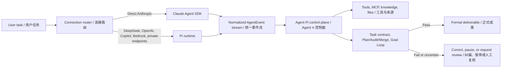

# Agent π / Agent Pi

<p align="center">
  
</p>

**中文** | Agent π 是基于 Craft Agents OSS 深度改造的 Windows 桌面智能体工作台，面向长周期项目分析、招投标文件处理、工程资料研究、多智能体协作和可追溯成果沉淀。

**English** | Agent Pi is a Windows desktop agent workbench forked and deeply adapted from Craft Agents OSS. It is designed for long-running project analysis, tender/document production, engineering research, multi-agent workflows, and traceable project outputs.

Agent π 的目标不是做一个普通聊天壳，而是把智能体升级为真实项目作业里的 **超级工作台**：主会话按工作目录组织，分支智能体折叠到主会话下，正式成果落回项目工作目录，过程文件可在应用内预览、编辑、导出，长任务由 Goal Loop 做自我审查和纠偏。

Agent Pi is not a thin chat wrapper. It is a project workbench: conversations are organized by working directory, spawned agents fold under the parent session, formal deliverables are written back to the project folder, files can be previewed/edited/exported inside the app, and Goal Loop reviews long tasks before accepting them as done.

## Dual Runtime, One Control Plane / 双运行时、统一控制面

Agent Pi's execution strength comes from **Claude Agent SDK or Pi as the model runtime, plus Agent Pi's own provider-independent control plane**. Claude Agent SDK and Pi both contribute to the product, but they do not normally generate the same turn together: one turn uses one selected LLM connection and one backend. This is a dual-runtime architecture, not an implicit mixture-of-agents.

Agent π 的强执行能力来自 **Claude Agent SDK 或 Pi 模型运行时，加上 Agent π 自有的、与模型供应商无关的统一控制面**。Claude Agent SDK 与 Pi 都是产品能力的重要基础，但通常不会在同一轮共同生成答案：每轮只使用一个选定的 LLM 连接和一个后端。这是“双运行时架构”，并不等同于默认启用多模型混合推理。



| Layer / 层 | English | 中文 |
| --- | --- | --- |
| Claude Agent SDK runtime | Direct Anthropic connections use Claude-native streaming, tool execution, hooks, session continuation, and model lifecycle semantics. | Anthropic 直连使用 Claude 原生流式响应、工具执行、Hooks、会话延续和模型生命周期语义。 |
| Pi runtime | DeepSeek, OpenAI/Codex, GitHub Copilot, Bedrock, compatible endpoints, and private models use Pi's unified provider layer, isolated agent subprocess with JSONL RPC, steering, retry, and context-compaction handling. | DeepSeek、OpenAI/Codex、GitHub Copilot、Bedrock、兼容端点和私有模型使用 Pi 的统一供应商层、通过 JSONL RPC 通信的隔离智能体子进程、动态引导、重试和上下文压缩处理。 |
| Normalized event contract | Backend-specific messages, tool calls, results, usage, errors, and terminal signals are converted into one `AgentEvent` stream. | 不同后端的消息、工具调用、结果、用量、错误和终态信号被转换为统一的 `AgentEvent` 事件流。 |
| Agent Pi control plane | A shared `SessionManager` applies source boundaries, permissions, working-directory isolation, MCP/API tools, task contracts, governed sub-agents, transactional artifacts, Plan/Audit/Merge, Goal Loop, and document-quality checks. | 统一 `SessionManager` 负责来源硬边界、权限、工作目录隔离、MCP/API 工具、任务契约、受控子智能体、事务化成果、Plan/Audit/Merge、Goal Loop 和文档质量检查。 |

`@anthropic-ai/sdk` is the lower-level Anthropic API client dependency; the Claude agent loop described above is provided by `@anthropic-ai/claude-agent-sdk`. / `@anthropic-ai/sdk` 是底层 Anthropic API 客户端依赖；上述 Claude 智能体循环由 `@anthropic-ai/claude-agent-sdk` 提供。

The runtime first lets the selected model reason and call tools; Agent Pi then decides whether the task is actually complete. A backend `complete` event only means that the model turn stopped. Formal completion still requires application-level evidence, output, format, source, and quality gates to pass. If a gate fails, Agent Pi can continue correction, pause for confirmation, or move the task to review.

运行时先让所选模型推理并调用工具，随后由 Agent π 判断任务是否真正完成。后端发出 `complete` 只代表模型本轮停止，并不代表任务已经合格；正式完成仍须通过应用层的证据、产物、格式、来源和质量门禁。门禁失败时，Agent π 可以继续纠偏、暂停等待确认，或把任务转入待审查。

This separation allows the same enterprise workflow to run on Anthropic models, DeepSeek, compatible domestic models, or privately deployed endpoints without rewriting business logic. It improves bounded autonomy for weaker models, but it does not erase model capability differences: professional accuracy still depends on authoritative sources, deterministic tools, verification, and human approval where required.

这种分层让同一套企业工作流可以运行在 Anthropic、DeepSeek、兼容国产模型或私有化端点上，而无需重写业务逻辑；它能提升较弱模型的受控自治能力，但不会消除模型本身的能力差异。专业准确性仍然依赖权威来源、确定性工具、校验以及必要的人工批准。

## Latest Version / 最新版本

**Current release: V2.2.3.**

**当前发布版：V2.2.3。**

GitHub Releases / 发布页:

[https://github.com/xiangxin2021cn/agent-pi/releases](https://github.com/xiangxin2021cn/agent-pi/releases)

## Recent Changes / 最近三次变更

### V2.2.3 Calculable BOQ Production Pack / V2.2.3 可计算 BOQ 生产包

V2.2.3 upgrades Tender Workbench BOQ pricing from narrative handoffs to machine-verifiable production data. Every priced item now carries a calculable productivity basis, activity/calendar linkage, and initial cash-flow allocation; deterministic merge gates reject incomplete coverage and semantic conflicts before downstream planning starts.

V2.2.3 将投标工作台 BOQ 组价从叙述性交接升级为机器可校验的生产数据。每个已组价条目均须携带可计算工效依据、进度活动/日历关联和初始现金流分期；下游策划启动前，确定性合并门禁会拒绝覆盖不全及语义冲突。

| Area / 模块 | English | 中文 |
| --- | --- | --- |
| Productivity basis | BOQ items record production rate, duration, calendar, activity, source, and assumptions; capacity must cover the stated quantity. | BOQ 条目记录生产率、持续时间、日历、活动、来源和假设，计算产能必须覆盖对应工程量。 |
| Initial cash flow | Each item supplies auditable period allocations with amount or weight, source, assumptions, and activity linkage. | 每个条目提供可审计的分期金额或权重，并记录来源、假设和活动关联。 |
| Cross-batch merge gate | Deterministic checks reject resource-unit, rate-unit, productivity, and activity-calendar contradictions across child-agent reports. | 确定性门禁拒绝子智能体报告之间的资源单位、费率单位、工效及活动日历矛盾。 |
| Completion readiness | Missing machine fields, incomplete item coverage, extra items, or altered child results prevent the BOQ capability pack from becoming ready. | 缺失机器字段、条目覆盖不全、越界条目或篡改子报告结果时，BOQ 能力包不得进入 ready。 |

### V2.2.2 Workbench Isolation and Large Documents / V2.2.2 工作台隔离与大型文档

V2.2.2 separates professional-workbench conversations even when they use the same physical project folder. Business sessions now have independent memory namespaces, and native path-backed attachments support large tender PDFs without loading them into renderer memory or the model context.

V2.2.2 即使多个专业工作台使用同一物理项目文件夹，也会保持会话隔离。业务会话采用独立记忆命名空间；原生路径型附件支持大型投标 PDF，且不会把文件整体载入渲染器内存或模型上下文。

| Area / 模块 | English | 中文 |
| --- | --- | --- |
| Workbench grouping | Tender, delivery, and investment conversations are grouped by business project instead of only by working-directory path. | 投标、实施和投资会话按业务项目分组，不再只按工作目录路径混合显示。 |
| Memory boundary | Every business conversation and child agent has a session-scoped Project Memory Lite namespace. | 每个业务会话及其子智能体拥有会话级 Project Memory Lite 命名空间。 |
| Large attachments | Native file-picker attachments support path-backed files up to 2 GiB; 200+ MiB PDFs are copied on disk rather than Base64 encoded. | 系统文件选择器支持至 2 GiB 的路径型附件；200 MiB 以上 PDF 通过磁盘复制而非 Base64 编码。 |
| Continuation and handoff | Goal Loop and child-agent handoff preserve large files as explicit path references. | Goal Loop 续跑及子智能体交接继续以明确路径引用大型文件。 |

### V2.2.1 Tender Production Pipeline / V2.2.1 投标生产流水线

V2.2.1 tightens document quality routing and upgrades Tender Workbench from isolated stage prompts into a dependent production pipeline. Tender analysis, BOQ five-step pricing, construction methodology, programme/resource/cost/cash-flow planning, formal submission documents, and final audit now have clearer handoffs and capability gates.

V2.2.1 收紧文档质量路由，并将投标工作台从彼此孤立的阶段提示升级为有依赖关系的生产流水线。标书分析、BOQ 逐项五步法组价、施工方法论、进度/资源/成本/现金流计划、正式递交文件和最终审查均有更清晰的交接与能力门禁。

| Area / 模块 | English | 中文 |
| --- | --- | --- |
| Tender pipeline | Stages now follow document analysis -> BOQ five-step pricing -> WORK PLAN AND PROPOSED METHODOLOGY -> programme/resources/cost/cash flow -> formal submission documents -> audit. | 阶段调整为标书分析 -> BOQ 五步法组价 -> WORK PLAN AND PROPOSED METHODOLOGY -> 进度/资源/成本/现金流 -> 正式递交文件 -> 审查。 |
| BOQ five-step pricing | A dedicated capability pack and skill require item-by-item scope, productivity, resource consumption, sourced rates, direct cost, and risk reconciliation. | 新增专用能力包和 skill，要求逐项记录范围、生产率、资源消耗、询源单价、直接成本和风险复核。 |
| Controlled sub-agents | Large BOQ scopes can dispatch child agents with narrow briefs, allowed sources, assigned items, and report paths; child agents cannot spawn further agents. | 大型清单可派发受控子智能体，brief 仅包含允许来源、分配条目和报告路径；子智能体禁止继续派生。 |
| Reliable child lifecycle | Active child agents remain authoritative until their structured reports are ready. The parent waits, monitors activity, and merges completed handoffs instead of taking over after a fixed timeout. | 活跃子智能体在结构化报告就绪前始终保持任务所有权；主会话持续等待并监控活动，只合并已完成交接，不再固定超时后自行接管。 |
| Workbench agent visibility | Tender Workbench now shows inherited child agents as a nested status tree with live state and message counts. | 投标工作台以嵌套状态树显示所属子智能体，并展示实时状态和消息数量。 |
| Formal submission documents | After planning, Agent Pi compiles required tender deliverables such as methodology, construction programme, labour/material/plant plan, and cash-flow plan. | 施工策划后编制投标要求的正式递交文件，包括方法论、施工进度计划、人材机计划和现金流计划。 |
| Quality routing | Native Quick stays close to upstream lightweight execution, while Guarded Quick and professional modes keep source boundaries and checks for higher-risk tasks. | 原生快速模式保留接近上游的轻量执行；受控快速和专业模式继续用于高风险任务的来源边界与检查。 |
| Core runtime | Claude Agent SDK is updated to 0.3.211 and Pi to 0.80.7; Anthropic SDK remains current at 0.111.0. | Claude Agent SDK 升级到 0.3.211，Pi 升级到 0.80.7；Anthropic SDK 保持当前最新版 0.111.0。 |

Older release details are available on GitHub Releases.

更早版本说明请查看 GitHub Releases。

## Core Capabilities / 核心能力

| Capability | English | 中文 |
| --- | --- | --- |
| Goal Loop | Reviews long-running tasks against the user's stated goal, required files, formats, evidence, and verification signals before accepting completion. | 按用户目标、必需文件、格式、证据和验证信号审查长任务结果，避免过早完成。 |
| Task Contract | Converts user instructions into a durable task contract with hard constraints, acceptance checks, evidence requirements, and forbidden shortcuts. | 将用户要求转成可持久化任务契约，记录硬约束、验收标准、证据要求和禁止偷懒项。 |
| Requirement Ledger | Tracks each material requirement with a stable ID, verification rule, status, evidence references, and failure reason across follow-up turns. | 跨后续轮次以稳定 ID、验证规则、状态、证据引用和失败原因追踪每项关键要求。 |
| Transactional Document Artifact | Writes long Markdown as recoverable sections and accepts completion only after hash-frozen atomic assembly and validation. | 将长 Markdown 写成可恢复章节，仅在冻结哈希、原子组装并校验后接受完成。 |
| Document Plan | Adds structure, audience, tone, section, table, chart, citation, and delivery-format expectations for document tasks. | 为文档任务提取标题、受众、语气、章节、表格、图表、引用和交付格式约束。 |
| Project Memory Lite | Stores local project facts, sources, citations, decisions, formal outputs, reviews, and quality telemetry under `.agent-pi/brain`. | 在 `.agent-pi/brain` 中沉淀来源、引用、决策、正式成果、审稿和质量经验。 |
| Enterprise Knowledge Base | Promotes local files into stable file-memory MCP knowledge sources with category/folder metadata and explicit user activation. | 将本地文件提升为稳定 file-memory MCP 知识源，带分类/文件夹元数据，并要求用户显式启用。 |
| Working-directory isolation | Locks sessions to a physical working directory so project memory and outputs do not leak across projects. | 会话锁定物理工作目录，项目记忆和正式成果按项目隔离。 |
| Formal outputs | Promotes deliverables into `Agent Pi Outputs` and labels files as formal output, attachment, data file, or process artifact. | 将成果提升到 `Agent Pi Outputs`，并区分正式成果、附件、数据文件和过程文件。 |
| File preview | Opens Markdown, text, code, JSON, PDF, Office, Excel, image, and sidecar Markdown previews inside the app where possible. | 在应用内预览 Markdown、文本、代码、JSON、PDF、Office、Excel、图片及 Markdown 伴随文件。 |
| Multi-agent sessions | Spawns sub-agents for parallel work while keeping them folded under the parent task and project directory. | 支持分智能体并行处理，并折叠到主会话和项目目录下。 |

## Download / 下载

Installers are published from GitHub Releases after validation:

安装包会在验证通过后发布到 GitHub Releases：

[https://github.com/xiangxin2021cn/agent-pi/releases/latest](https://github.com/xiangxin2021cn/agent-pi/releases/latest)

Release assets / 发布资产:

- Windows x64: `Agent-Pi-x64.exe`, `Agent-Pi-x64.exe.blockmap`, `latest.yml`
- macOS Apple Silicon: `Agent-Pi-arm64.dmg`, `Agent-Pi-arm64.zip`
- macOS Intel: `Agent-Pi-x64.dmg`, `Agent-Pi-x64.zip`, shared `latest-mac.yml`
- Linux x64: `Agent-Pi-x64.AppImage`, `latest-linux.yml`

## User Manual / 用户手册

Read the manual before using Agent Pi on production project work:

真实项目落地前建议先阅读用户手册：

[docs/USER_MANUAL.md](docs/USER_MANUAL.md)

The manual covers installation, Workspace, working directories, session folding, model switching, file preview, formal outputs, sources, skills, automations, and troubleshooting.

手册覆盖 Windows 安装、Workspace、工作目录、会话折叠、模型切换、文件预览、正式输出、数据源、技能、自动化和常见问题处理。

## Roadmap / 未来路线

Agent Pi will continue moving from a general AI desktop toward a vertical professional agent workbench. The long-term direction is not just chatting with files, but producing auditable, editable, source-grounded project artifacts.

Agent π 将从通用 AI 桌面应用继续向垂直专业智能体工作台演进。长期目标不是“和文件聊天”，而是持续生成可审查、可编辑、有来源、有过程记忆的项目成果。

Future directions include:

- Construction and tender intelligence: PDF drawing recognition, OCR/vector extraction, BOQ reconciliation, quantity takeoff, construction planning, cost-loaded schedules, and highway/civil tender workflows.
- Engineering and BIM workflows: road/corridor data models, IFC/GeoJSON/LandXML-style intermediate data, Blender/Bonsai/IfcOpenShell visualization, 4D progress views, and model-backed report figures.
- Professional document automation: Word/PDF/DOCX output quality, strict template matching, structured evidence matrices, evidence-rich Markdown, visual asset generation, export verification, and Agent Pi's document workflow quality modes.
- Multi-agent document production: chapter-agent assignments, role review, final synthesis ownership, and cross-chapter consistency checks for large tenders, engineering reports, investment reports, and due diligence.
- Enterprise knowledge: local-global knowledge MCPs first, then team/network knowledge bases, permission governance, category management, and reusable company standards.
- Domain-specific intelligence: investment analysis, GIS reporting, simulation/ANSYS/CAE post-processing, legal/compliance review, and other vertical expert workflows.

未来重点包括：

- 施工与投标智能：PDF 图纸识别、OCR/矢量提取、BOQ 对照、工程量拆分、施工策划、成本加载进度计划、公路/市政投标工作流。
- 工程与 BIM：道路/廊道数据模型、IFC/GeoJSON/LandXML 类中间数据、Blender/Bonsai/IfcOpenShell 可视化、4D 进度展示、模型驱动报告图。
- 专业文档自动化：Word/PDF/DOCX 成果质量、严格模板匹配、结构化证据矩阵、有证据的 Markdown、专业图表资产生成、导出校验，以及 Agent π 自有的文档工作流质量模式。
- 多智能体文档生产：面向大型投标、工程报告、投资报告和尽调任务的章节智能体分工、多角色评审、最终合成负责人和跨章节一致性检查。
- 知识库：先做本机全局知识 MCP 和分类/文件夹管理，再扩展团队/联网知识库、权限治理、分类管理和企业标准复用。
- 垂直领域智能：投资分析、GIS 报告、仿真/ANSYS/CAE 后处理、法律合规审查以及更多行业专家工作流。

## Collaboration / 合作共建

Agent Pi welcomes vertical-domain experts, engineers, researchers, builders, and teams who want to turn agent workflows into real production systems. We especially welcome contributors in construction management, quantity surveying, tendering, BIM/GIS, structural simulation, investment analysis, knowledge-base management, document automation, MCP tooling, and agent runtime engineering.

Agent π 欢迎垂直领域专家、工程师、研究者、开发者和团队共同参与，把智能体工作流真正做成可落地的生产系统。特别欢迎施工管理、工程造价、招投标、BIM/GIS、结构仿真、投资分析、知识库管理、文档自动化、MCP 工具和智能体运行时方向的伙伴加入。

## Development / 开发

Install dependencies / 安装依赖:

```bash
bun install
```

Run checks / 运行检查:

```bash
bun run typecheck:all
bun run lint
```

Build a local Windows installer without uploading to GitHub / 本地生成 Windows 安装包但不上传 GitHub:

```powershell
cd apps/electron
powershell -ExecutionPolicy Bypass -File scripts/build-win.ps1
```

## License / 许可证

Apache-2.0
