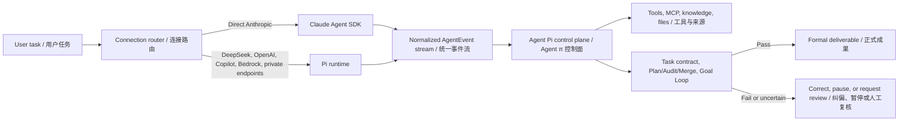

# Agent π / Agent Pi

<p align="center">
  
</p>

**中文** | Agent π 是基于 Craft Agents OSS 深度改造的 Windows 桌面智能体工作台，面向长周期项目分析、招投标文件处理、工程资料研究、多智能体协作和可追溯成果沉淀。

**English** | Agent Pi is a Windows desktop agent workbench forked and deeply adapted from Craft Agents OSS. It is designed for long-running project analysis, tender/document production, engineering research, multi-agent workflows, and traceable project outputs.

Agent π 的目标不是做一个普通聊天壳，而是把智能体升级为真实项目作业里的 **超级工作台**：主会话按工作目录组织，分支智能体折叠到主会话下，正式成果落回项目工作目录，过程文件可在应用内预览、编辑、导出，长任务由 Goal Loop 做自我审查和纠偏。

Agent Pi is not a thin chat wrapper. It is a project workbench: conversations are organized by working directory, spawned agents fold under the parent session, formal deliverables are written back to the project folder, files can be previewed/edited/exported inside the app, and Goal Loop reviews long tasks before accepting them as done.

## Dual Runtime, One Control Plane / 双运行时、统一控制面

Agent Pi's execution strength comes from **Claude Agent SDK or Pi as the model runtime, plus Agent Pi's own provider-independent control plane**. Claude Agent SDK and Pi both contribute to the product, but they do not normally generate the same turn together: one turn uses one selected LLM connection and one backend. This is a dual-runtime architecture, not an implicit mixture-of-agents.

Agent π 的强执行能力来自 **Claude Agent SDK 或 Pi 模型运行时，加上 Agent π 自有的、与模型供应商无关的统一控制面**。Claude Agent SDK 与 Pi 都是产品能力的重要基础，但通常不会在同一轮共同生成答案：每轮只使用一个选定的 LLM 连接和一个后端。这是“双运行时架构”，并不等同于默认启用多模型混合推理。



| Layer / 层 | English | 中文 |
| --- | --- | --- |
| Claude Agent SDK runtime | Direct Anthropic connections use Claude-native streaming, tool execution, hooks, session continuation, and model lifecycle semantics. | Anthropic 直连使用 Claude 原生流式响应、工具执行、Hooks、会话延续和模型生命周期语义。 |
| Pi runtime | DeepSeek, OpenAI/Codex, GitHub Copilot, Bedrock, compatible endpoints, and private models use Pi's unified provider layer, isolated agent subprocess with JSONL RPC, steering, retry, and context-compaction handling. | DeepSeek、OpenAI/Codex、GitHub Copilot、Bedrock、兼容端点和私有模型使用 Pi 的统一供应商层、通过 JSONL RPC 通信的隔离智能体子进程、动态引导、重试和上下文压缩处理。 |
| Normalized event contract | Backend-specific messages, tool calls, results, usage, errors, and terminal signals are converted into one `AgentEvent` stream. | 不同后端的消息、工具调用、结果、用量、错误和终态信号被转换为统一的 `AgentEvent` 事件流。 |
| Agent Pi control plane | A shared `SessionManager` applies source boundaries, permissions, working-directory isolation, MCP/API tools, task contracts, governed sub-agents, transactional artifacts, Plan/Audit/Merge, Goal Loop, and document-quality checks. | 统一 `SessionManager` 负责来源硬边界、权限、工作目录隔离、MCP/API 工具、任务契约、受控子智能体、事务化成果、Plan/Audit/Merge、Goal Loop 和文档质量检查。 |

`@anthropic-ai/sdk` is the lower-level Anthropic API client dependency; the Claude agent loop described above is provided by `@anthropic-ai/claude-agent-sdk`. / `@anthropic-ai/sdk` 是底层 Anthropic API 客户端依赖；上述 Claude 智能体循环由 `@anthropic-ai/claude-agent-sdk` 提供。

The runtime first lets the selected model reason and call tools; Agent Pi then decides whether the task is actually complete. A backend `complete` event only means that the model turn stopped. Formal completion still requires application-level evidence, output, format, source, and quality gates to pass. If a gate fails, Agent Pi can continue correction, pause for confirmation, or move the task to review.

运行时先让所选模型推理并调用工具，随后由 Agent π 判断任务是否真正完成。后端发出 `complete` 只代表模型本轮停止，并不代表任务已经合格；正式完成仍须通过应用层的证据、产物、格式、来源和质量门禁。门禁失败时，Agent π 可以继续纠偏、暂停等待确认，或把任务转入待审查。

This separation allows the same enterprise workflow to run on Anthropic models, DeepSeek, compatible domestic models, or privately deployed endpoints without rewriting business logic. It improves bounded autonomy for weaker models, but it does not erase model capability differences: professional accuracy still depends on authoritative sources, deterministic tools, verification, and human approval where required.

这种分层让同一套企业工作流可以运行在 Anthropic、DeepSeek、兼容国产模型或私有化端点上，而无需重写业务逻辑；它能提升较弱模型的受控自治能力，但不会消除模型本身的能力差异。专业准确性仍然依赖权威来源、确定性工具、校验以及必要的人工批准。

## Latest Version / 最新版本

**Current release: V2.6.3.**

**当前发布版：V2.6.3。**

GitHub Releases / 发布页:

[https://github.com/xiangxin2021cn/agent-pi/releases](https://github.com/xiangxin2021cn/agent-pi/releases)

## Recent Changes / 最近三次变更

### V2.6.3 Stray `nul` File Hotfix / V2.6.3 工作目录 `nul` 文件热修

V2.6.3 stops Git Bash from creating a real file named `nul` in the project folder. Agent shell commands often use cmd.exe `2>nul`; Git Bash treats that as a filename, not the NUL device. Those redirects are rewritten to `/dev/null` before the command runs.

V2.6.3 热修工作目录里莫名出现的 `nul` 文件。智能体 Bash 在 Windows 上走 Git Bash，模型常写 `del … 2>nul`；Git Bash 会把 `nul` 当成普通文件名写进项目目录。现已在执行前改成 `/dev/null`。

| Area / 模块 | English | 中文 |
| --- | --- | --- |
| Bash redirect rewrite | `>nul` / `2>nul` / `&>nul` become `/dev/null` before Git Bash runs. | 执行前把 cmd 空设备重定向改成 Git Bash 的 `/dev/null`。 |
| Reserved device writes | Write/Edit to `nul` / `con` / `prn` is blocked; `nul` is not treated as a file write for permissions. | 禁止向 Windows 保留设备名写入；权限检查不再把 `2>nul` 当成写文件。 |

### V2.6.2 Session Files Loading Hotfix / V2.6.2 会话文件加载热修

V2.6.2 unsticks the right-hand Session Files tree after the 2.6.0 on-demand refresh: Official Outputs folders no longer stay on **加载中…**, and expanding `orchestration/briefs` is not blocked behind a full working-folder walk.

V2.6.2 热修右侧会话文件树：正式输出子目录不再停在「加载中…」，展开 `briefs` / `reports` 时不会被整个工作目录扫描堵住。

| Area / 模块 | English | 中文 |
| --- | --- | --- |
| Loading pill | Expand/refresh always clears; 20s timeout; retry after collapse/expand; hydrate persisted expanded folders. | 加载态必清、超时、可重试；已展开占位目录会回填。 |
| Working folder scan | Root listing is depth 0 (`node_modules` not pre-walked). Official Outputs still lists one extra level. | 工作目录根列表不再预扫第二层；正式输出仍先列出一层子目录。 |

### V2.6.1 Formal Writing Skills + Claude SDK 0.3.229 / V2.6.1 正式撰写 skill 与 Claude SDK 升级

V2.6.1 auto-attaches first-party `professional-report` or `tender-formal-writing` on formal document turns, fails quality audit on AI-filler prose even when citations look complete, and uplifts Claude Agent SDK **0.3.228 → 0.3.229**. Pi stays on latest **0.84.1**. Marketplace skill auto-install is not used.

V2.6.1 在专业/严格文档任务与投标阶段草稿上自动加载内置撰写 skill，文档质检会卡住套话稿，并将 Claude Agent SDK 升到 **0.3.229**。Pi 仍为最新 **0.84.1**。不会从市场自动安装 skill。

| Area / 模块 | English | 中文 |
| --- | --- | --- |
| Writing skills | Formal turns load `professional-report` (research/analysis/diligence/briefs) or `tender-formal-writing` (tender artifacts). Correspondence and quick chat skip attach. | 正式轮次挂内置撰写 skill；函件与快速聊天不挂。 |
| Craft gate | `analyzeDocumentQuality` fails 综上所述 / Furthermore / pack-path catalog tone even if evidence scores pass. | 证据看起来齐、但仍是套话稿 → 质检失败。 |
| Short contract | Tender stage drafts keep a short hard-ban block that names `[skill:tender-formal-writing]`. | 投标写作契约缩短为硬禁令并点名撰写 skill。 |
| Runtime | Claude Agent SDK **0.3.229**; Pi **0.84.1** (already latest). | 打包运行时：Claude 0.3.229；Pi 无新版。 |

### V2.6.0 Project Boundary Desk + Workbench UX / V2.6.0 项目边界登记台与工作台体验

V2.6.0 makes tender jurisdiction and **project boundary** an explicit registration/confirmation desk before BOQ pricing, hard-fences pricing briefs to that pack, and ships workbench UX that stays usable while long jobs run. New projects default to `generic-international`; SANRAL/C5.1 remains a selectable `sa-sanral-highway` profile. Packaged runtime: Claude Agent SDK **0.3.228**; Pi **0.84.1**.

V2.6.0 把辖区与项目边界做成组价前可确认的登记台，组价 brief 以该包为硬围栏；同时补齐长任务下的工作台体验。新项目默认 `generic-international`；SANRAL/C5.1 仍可选。打包运行时：Claude Agent SDK **0.3.228**；Pi **0.84.1**。

| Area / 模块 | English | 中文 |
| --- | --- | --- |
| Boundary desk + BOQ fence | Users pick enterprise knowledge, bind this-tender specs, and attach bidder-owned files. The parent session parses them into `project_boundary`; that pack is injected into BOQ briefs as a hard fence. Unconfirmed or still-parsing packs cannot unlock pricing. | 用户选择企业知识库、绑定本标规范、附上投标人自有文件；主会话解析写入 `project_boundary`，该包作为组价硬围栏。未确认或仍在解析时不能解锁组价。 |
| Jurisdiction profiles | Registry `knowledge/profiles.json`. Default `generic-international` (`knowledge/tender-generic/`); SANRAL/C5.1 is `sa-sanral-highway`. | 新项目默认通用国际包；SANRAL/C5.1 为可选辖区。 |
| DeepSeek vision bridge | Settings → AI → Edit DeepSeek connection → **Vision support**. A VLM key (default Zhipu GLM-4.6V Flash) reads attached images in the same turn. | DeepSeek V4 不能直接看图；开启视觉支持后由 VLM 同轮读图转文字。 |
| Force-pass | Monitor toolbar **强制放行** next to 检查 when a stage is blocked or missing items (including planning substeps). Completed batches are not deleted. | 流程监控顶栏「检查」旁可强制放行；已完成批次不会被删。 |
| Live HTML artifacts | Session-file `.html` / `.htm` runs as a full webpage (scripts, relative CSS/JS, `/assets/`). **Open in browser** uses the in-app browser. Chat `html-preview` blocks stay sandboxed. | 右侧文件树打开 HTML 按完整网页运行；对话里的 `html-preview` 仍沙箱禁脚本。 |
| Session Files on demand | File tree no longer auto-reloads on every disk write. Reloads on session change, folder expand, or the refresh button. | 右侧文件树不再整树自动刷新；展开文件夹或点刷新才更新。 |
| Writing contract | Parse memos, BOQ workpapers, methodology, programme/cash-flow narratives, and returnables must be tender-grounded with AI filler stripped. | 解析纪要、组价底稿和正式回标须紧扣招标资料、去掉 AI 套话。 |
| Official Outputs BOQ MD | Chapter workpapers, `施工资源消耗总表.md`, and a stage summary publish into `Agent Pi Outputs/<parentSessionId>/`. | 组价完成后章节底稿与资源总表出现在主会话正式输出。 |
| Parallel resume | Idle children continue in parallel up to `maxConcurrency` (default 4). Standby/wake `EPIPE` from dead Pi subprocesses no longer exits the app. | 恢复补位并行吃满并发；待机唤醒僵死子进程不再冲垮主进程。 |

### V2.5.3 Stream Cap + Monitor Continue / V2.5.3 大工具输出上限与监控接续

V2.5.3 caps streamed tool output at 4 MiB per call so huge PDF/OCR/Excel streams no longer crash the main process, and the tender monitor continues idle child sessions instead of spawning duplicates.

V2.5.3 将单次工具流式输出上限设为 4 MiB，避免大 PDF/OCR/Excel 撑崩主进程；投标监控接续已有空闲子会话，不再重复派发。

### V2.5.2 Soft Gates + Official Outputs MD / V2.5.2 软门禁与正式输出 MD

V2.5.2 softens tender stage gates so usable results advance the pipeline, publishes analysis Markdown into Official Outputs, adds a panel deliverables quality check, and keeps the Working Folder collapsed by default on tender main sessions.

V2.5.2 放宽投标阶段门禁（有可用结果即可推进），把解析 MD 发布到正式输出，增加监控面板「成果质检并整理」，并默认收起主会话工作文件夹。

### V2.5.0 Tender Control Plane + Runtime Uplift / V2.5.0 投标控制面与运行时升级

V2.5.0 ships the tender workbench control plane (start/advance/stop/reset, selective batch retry, monitor that survives chat navigation), stops main-process starvation that blocked returning to Overview (`businessProjects:list` timeout), and uplifts Claude Agent SDK to 0.3.227 (Pi stays on latest 0.84.1).

V2.5.0 交付投标工作台控制面（start/advance/停止派发/重置编排、按批重试、切到对话仍监控补位），修复主进程饿死导致无法立刻回到监控面板（`businessProjects:list` 超时）的问题，并将 Claude Agent SDK 升级到 0.3.227（Pi 保持最新 0.84.1）。

### V2.4.0 Tender Workbench Restructure / V2.4.0 投标工作台业务化重构

V2.4.0 restructures the tender workbench: BOQ pricing batches follow BOQ pages (one COTO chapter per subagent), children verify market rates online with recorded evidence, lenient normalization plus per-item validation ends format-driven invalid loops, the runtime owns the merged pricing pack, parent sessions auto-resume when batches finish, and the nine micro-stages consolidate into five business stages with legacy-id aliases.

V2.4.0 重构投标工作台：BOQ 组价按 BOQ 页（每页一个 COTO 章节）派生子智能体并联网询价留证；宽容归一化与逐条验收终结格式死循环；合并定价包由运行时确定性写入；批次完成后主会话自动闭环；九个碎阶段收敛为五个业务阶段并兼容旧 ID。

### V2.3.4 Document-Analysis Merge Loop Fix / V2.3.4 文档分析合并死循环修复

V2.3.4 namespaces duplicate child section ids during document-analysis merge and prevents parent agents from overwriting the pack with compressed inline JSON, stopping the compress/retry loop against deep-equal merge gates.

V2.3.4 在 document_analysis 合并时对重复子报告 section id 做 documentId 命名空间，并禁止主会话用压缩内联 JSON 覆盖终包，打断与深相等门禁互相打架的压缩重试循环。

### V2.3.3 Tender Document-Analysis Deliverables / V2.3.3 招标文件分析成果闭环

V2.3.3 deterministically merges completed document-analysis batch reports into `packs/document-analysis.json`, writes a readable summary under `Agent Pi Outputs/<parentSession>/`, and exposes the tender workspace tree in the session files sidebar.

V2.3.3 在全部文档分析批次完成后确定性合并写入 `packs/document-analysis.json`，同步生成 `Agent Pi Outputs/<主会话>/document-analysis-summary.md`，并在会话文件侧栏暴露投标工作区产物树。

### V2.3.2 Tender Retry Fix + Runtime Uplift / V2.3.2 投标重试修复与运行时升级

V2.3.2 fixes tender workbench batch retry false-failures when spawn handoff slots are full, uplifts Claude Agent SDK to 0.3.226 and Pi runtime to 0.84.1, and rebinds business-tool working directories on restored/spawned sessions.

V2.3.2 修复投标工作台在 spawn handoff 槽位满时重试误报失败的问题，将 Claude Agent SDK 升级到 0.3.226、Pi 运行时升级到 0.84.1，并修复恢复/派生会话中业务工具未重新绑定工作目录的问题。

### V2.3.1 Pi 0.83 + HTML Artifacts / V2.3.1 Pi 0.83 与 HTML 产物

V2.3.1 builds on the V2.3.0 Self-Harness release. Pi runtime moves to 0.83.0 (Copilot OAuth + catalog typing adapted). Official Output and working-directory `.html` / `.htm` files open in a sandboxed render preview with Preview/Code toggle and Save As. Claude Agent SDK moves to 0.3.222.

V2.3.1 基于 V2.3.0 Self-Harness：Pi 运行时升级到 0.83.0（已适配 Copilot OAuth 与模型目录类型）；正式输出与工作目录中的 `.html` / `.htm` 可沙箱渲染预览，支持预览/代码切换与另存为；Claude Agent SDK 升级到 0.3.222。

### V2.3.0 Bounded Self-Harness / V2.3.0 有边界的自适应执行

V2.3.0 makes recurring execution failures reusable without allowing the agent to rewrite production code. Within one turn, an identical failed tool call can be retried once; after the second identical failure Agent Pi blocks that route and requires changed input, a verified fallback, or user review. A sanitized workspace Harness Store records only verified recovery shapes, provider/model/mode profiles, hashes, and explicit quality feedback. Similar future tasks can receive up to three proven route hints. User corrections become regression candidates, while global policies remain a constrained, non-executable DSL and can be promoted only after target improvement, no held-out regression, a fully passing protected suite, and retained rollback metadata. This release also adds renderer crash recovery, spawn memory soft-guards, and a Tender Workbench bridge that can use audited `STAGE_CLOSEOUT*.md` evidence to satisfy `document_analysis` readiness without fabricating downstream data packs.

V2.3.0 让反复出现的执行失败可以被复用，但不允许智能体在运行时改写生产代码。同一轮中，同一个失败工具调用最多重试一次；第二次完全相同的调用仍失败后，Agent π 会阻止继续原样重试，要求修改参数、改走已验证路线或转人工复核。工作区 Harness Store 只保存已验证的恢复形状、供应商/模型/模式画像、哈希和用户明确质量反馈；相似任务最多注入三条成功路线提示。用户指出的跑偏、漏项、模板不符、深度不足、证据或格式问题会转成回归候选；全局策略采用受限且不可执行的规则 DSL，只有目标用例提升、留出用例不退化、保护用例全部通过并保留版本哈希和回滚链时才可晋升。本版同时加入 renderer 崩溃恢复、子智能体内存软保护，以及投标工作台 `STAGE_CLOSEOUT*.md` 人工审计证明解锁 `document_analysis` 的桥接能力，不会伪造后续数据包。

| Area / 模块 | English | 中文 |
| --- | --- | --- |
| Bounded tool recovery | One identical retry is allowed; repeated identical failure forces a changed route or review instead of consuming tokens in a loop. | 同一调用只允许一次原样重试；重复失败后强制换路线或复核，避免循环浪费 token。 |
| Verified route reuse | Sanitized successful recovery shapes are matched by task plus provider/model/mode and injected as bounded advice. | 按任务及供应商/模型/模式匹配脱敏成功路线，并以有限提示复用。 |
| Feedback regression | Explicit user corrections become deduplicated regression candidates; they do not silently rewrite global behavior. | 用户明确纠错会形成去重回归候选，不会静默改写全局行为。 |
| Deterministic BOQ gate | Completion depends on exact BOQ IDs, counts, child-report equality, schemas, and contradiction checks, not completion claims. | BOQ 完成取决于条目 ID、数量、子报告一致性、结构和矛盾检查，而不是智能体自称完成。 |
| Executable template profile | Uploaded templates are parsed into section, page, margin, style, font, numbering, header/footer, table, and caption constraints and checked against exported DOCX evidence. | 上传模板被解析为章节、纸张、页边距、样式、字体、编号、页眉页脚、表格和题注约束，并与导出 DOCX 证据核对。 |
| Harness observability | The existing Info panel shows matched routes, current recovery decision, feedback/regression counts, and compact Goal status. | 现有信息弹窗显示命中路线、当前纠偏决策、反馈/回归数量及简洁 Goal 状态。 |
| Runtime stability | Renderer crashes reload the window with rate limiting, and `spawn_session` is blocked when Electron crosses memory soft limits. | Renderer 崩溃会限频重载窗口；Electron 超过内存软阈值时会阻止继续创建子智能体。 |
| Tender closeout bridge | Audited `STAGE_CLOSEOUT*.md` evidence can satisfy `document_analysis` readiness and unblock later Tender Workbench stages without fake BOQ packs. | 经审计的 `STAGE_CLOSEOUT*.md` 可满足 `document_analysis` 就绪条件，解锁后续投标阶段且不伪造 BOQ 包。 |

### V2.2.6 Multi-Agent Recovery and DeepSeek V4 Endpoint Limits / V2.2.6 多智能体恢复与 DeepSeek V4 端点上限

V2.2.6 keeps Tender Workbench multi-agent runs bounded without turning failures into permanent deadlocks. Parent sessions still wait while child agents are actively processing, but failed, stale, or missing child handoffs now move into a recoverable state: retry the child, ask the user, or continue with explicit missing-child gaps. This hotfix also prevents a queued parent recovery instruction from being re-queued behind the same failed-child review barrier, which caused repeated "waiting for structured child handoff" loops. Parent sessions remain blocked from fabricating child-owned report files. Custom endpoint models named `deepseek-v4`, `deepseek-v4-pro`, `deepseek-v4-flash`, `deepseek-chat`, or `deepseek-reasoner` now register with 1M context and 384K max output defaults, with manual override syntax such as `deepseek-v4-pro@ctx=1000000@out=384000`.

V2.2.6 保持投标工作台多智能体边界，但不再把失败变成永久死锁。子智能体仍在运行时主会话继续等待；子智能体失败、超时或未写出 handoff 时，会进入可恢复状态：重试子任务、询问用户，或在明确记录缺失项后继续。本次热修还阻止主会话恢复指令被重新排到同一个失败子任务复核屏障后面，避免反复刷出“等待结构化 handoff”的循环。主会话仍禁止伪造子智能体专属报告文件。自定义端点模型名为 `deepseek-v4`、`deepseek-v4-pro`、`deepseek-v4-flash`、`deepseek-chat` 或 `deepseek-reasoner` 时，默认注册 100 万上下文和 38.4 万最大输出，并支持 `deepseek-v4-pro@ctx=1000000@out=384000` 形式的手动覆盖。

| Area / 模块 | English | 中文 |
| --- | --- | --- |
| Handoff recovery | Active children keep ownership; failed or missing child reports unblock into explicit recovery instead of infinite waiting. | 运行中的子智能体继续拥有任务；失败或缺失报告会解除无限等待，进入显式恢复。 |
| Report ownership | Parent sessions still cannot create, edit, or replace child-owned handoff report paths. | 主会话仍不能创建、修改或替换子智能体专属 handoff 报告路径。 |
| DeepSeek V4 endpoints | Known DeepSeek V4 custom model IDs receive 1M context and 384K output defaults; custom overrides can be typed in the model field. | 已知 DeepSeek V4 自定义模型自动获得 100 万上下文与 38.4 万输出默认值；模型输入框支持手动覆盖。 |
| Core runtime | Claude Agent SDK 0.3.214, Anthropic SDK 0.112.3, and Pi 0.80.10. | Claude Agent SDK 升级至 0.3.214，Anthropic SDK 升级至 0.112.3，Pi 保持最新的 0.80.10。 |

### V2.2.5 Stability and Responsiveness / V2.2.5 稳定性与流畅性

V2.2.5 focuses on keeping large Tender Workbench sessions responsive. The session file panel now uses shallow initial scans and loads folder children only when expanded, so large Official Outputs and document-artifact trees no longer trigger full recursive scans on every refresh. Production builds also write an always-on `stability.log` for renderer exits, child-process exits, unresponsive transitions, uncaught exceptions, and memory peaks. Automation services stay dormant unless a workspace actually has `automations.json`, and startup permission reconciliation is scoped to active or explicitly non-default sessions.

V2.2.5 聚焦大型投标工作台会话的稳定性和流畅性。会话文件面板改为初始浅扫，只有展开文件夹时才加载子项，避免大型 Official Outputs 和 document-artifact 树在每次刷新时全量递归扫描。发布版新增常驻 `stability.log`，记录 renderer 退出、子进程退出、无响应转换、未捕获异常和内存峰值。自动化服务仅在工作区确实存在 `automations.json` 时启动，启动阶段权限校准也缩小到活动或显式非默认会话。

| Area / 模块 | English | 中文 |
| --- | --- | --- |
| Lazy file tree | Initial session-file loading is shallow; folder children are fetched only on expand, with path-boundary checks. | 初始会话文件加载只做浅扫；展开文件夹时才读取子项，并带路径边界检查。 |
| Stability diagnostics | `~/.agent-pi/logs/stability.log` records renderer crashes, child-process exits, unresponsive/responsive events, exceptions, rejections, and memory peaks. | `~/.agent-pi/logs/stability.log` 记录 renderer 崩溃、子进程退出、卡死/恢复、异常、Promise 拒绝和内存峰值。 |
| Lower idle load | Automation runtime starts only when configured; permission reconciliation no longer scans every session by default. | 自动化运行时仅在配置存在时启动；权限状态校准不再默认扫描全部会话。 |
| Regression tests | Added lazy-loading and stability telemetry coverage; watcher tests match the safer debounce window. | 增加懒加载和稳定性遥测测试；watcher 测试匹配更稳妥的 debounce 窗口。 |

Older release details are available on GitHub Releases.

更早版本说明请查看 GitHub Releases。

## Core Capabilities / 核心能力

| Capability | English | 中文 |
| --- | --- | --- |
| Goal Loop | Reviews long-running tasks against the user's stated goal, required files, formats, evidence, and verification signals before accepting completion. | 按用户目标、必需文件、格式、证据和验证信号审查长任务结果，避免过早完成。 |
| Bounded Self-Harness | Stops repeated identical tool failures, reuses sanitized verified recovery routes, and turns explicit user corrections into regression candidates without runtime self-modifying code. | 阻止相同工具失败反复循环，复用脱敏且已验证的恢复路线，并将用户明确纠错转成回归候选，但不在运行时自改代码。 |
| Task Contract | Converts user instructions into a durable task contract with hard constraints, acceptance checks, evidence requirements, and forbidden shortcuts. | 将用户要求转成可持久化任务契约，记录硬约束、验收标准、证据要求和禁止偷懒项。 |
| Requirement Ledger | Tracks each material requirement with a stable ID, verification rule, status, evidence references, and failure reason across follow-up turns. | 跨后续轮次以稳定 ID、验证规则、状态、证据引用和失败原因追踪每项关键要求。 |
| Transactional Document Artifact | Writes long Markdown as recoverable sections and accepts completion only after hash-frozen atomic assembly and validation. | 将长 Markdown 写成可恢复章节，仅在冻结哈希、原子组装并校验后接受完成。 |
| Document Plan | Adds structure, audience, tone, section, table, chart, citation, and delivery-format expectations for document tasks. | 为文档任务提取标题、受众、语气、章节、表格、图表、引用和交付格式约束。 |
| Project Memory Lite | Stores local project facts, sources, citations, decisions, formal outputs, reviews, and quality telemetry under `.agent-pi/brain`. | 在 `.agent-pi/brain` 中沉淀来源、引用、决策、正式成果、审稿和质量经验。 |
| Enterprise Knowledge Base | Promotes local files into stable file-memory MCP knowledge sources with category/folder metadata and explicit user activation. | 将本地文件提升为稳定 file-memory MCP 知识源，带分类/文件夹元数据，并要求用户显式启用。 |
| Working-directory isolation | Locks sessions to a physical working directory so project memory and outputs do not leak across projects. | 会话锁定物理工作目录，项目记忆和正式成果按项目隔离。 |
| Formal outputs | Promotes deliverables into `Agent Pi Outputs` and labels files as formal output, attachment, data file, or process artifact. | 将成果提升到 `Agent Pi Outputs`，并区分正式成果、附件、数据文件和过程文件。 |
| File preview | Opens Markdown, text, code, JSON, PDF, Office, Excel, image, sidecar Markdown, and live HTML artifacts (scripts + relative assets) inside the app where possible. | 在应用内预览 Markdown、文本、代码、JSON、PDF、Office、Excel、图片、Markdown 伴随文件，以及可运行脚本与相对资源的 HTML 产物。 |
| Multi-agent sessions | Spawns sub-agents for parallel work while keeping them folded under the parent task and project directory. | 支持分智能体并行处理，并折叠到主会话和项目目录下。 |

## Download / 下载

Installers are published from GitHub Releases after validation:

安装包会在验证通过后发布到 GitHub Releases：

[https://github.com/xiangxin2021cn/agent-pi/releases/latest](https://github.com/xiangxin2021cn/agent-pi/releases/latest)

Release assets / 发布资产:

- Windows x64: `Agent-Pi-x64.exe`, `Agent-Pi-x64.exe.blockmap`, `latest.yml`
- macOS Apple Silicon: `Agent-Pi-arm64.dmg`, `Agent-Pi-arm64.zip`
- macOS Intel: `Agent-Pi-x64.dmg`, `Agent-Pi-x64.zip`, shared `latest-mac.yml`
- Linux x64: `Agent-Pi-x64.AppImage`, `latest-linux.yml`

## User Manual / 用户手册

Read the manual before using Agent Pi on production project work:

真实项目落地前建议先阅读用户手册：

[docs/USER_MANUAL.md](docs/USER_MANUAL.md)

The manual covers installation, Workspace, working directories, session folding, model switching, file preview, formal outputs, sources, skills, automations, and troubleshooting.

手册覆盖 Windows 安装、Workspace、工作目录、会话折叠、模型切换、文件预览、正式输出、数据源、技能、自动化和常见问题处理。

## Roadmap / 未来路线

Agent Pi will continue moving from a general AI desktop toward a vertical professional agent workbench. The long-term direction is not just chatting with files, but producing auditable, editable, source-grounded project artifacts.

Agent π 将从通用 AI 桌面应用继续向垂直专业智能体工作台演进。长期目标不是“和文件聊天”，而是持续生成可审查、可编辑、有来源、有过程记忆的项目成果。

Future directions include:

- Construction and tender intelligence: PDF drawing recognition, OCR/vector extraction, BOQ reconciliation, quantity takeoff, construction planning, cost-loaded schedules, and highway/civil tender workflows.
- Engineering and BIM workflows: road/corridor data models, IFC/GeoJSON/LandXML-style intermediate data, Blender/Bonsai/IfcOpenShell visualization, 4D progress views, and model-backed report figures.
- Professional document automation: Word/PDF/DOCX output quality, strict template matching, structured evidence matrices, evidence-rich Markdown, visual asset generation, export verification, and Agent Pi's document workflow quality modes.
- Multi-agent document production: chapter-agent assignments, role review, final synthesis ownership, and cross-chapter consistency checks for large tenders, engineering reports, investment reports, and due diligence.
- Enterprise knowledge: local-global knowledge MCPs first, then team/network knowledge bases, permission governance, category management, and reusable company standards.
- Domain-specific intelligence: investment analysis, GIS reporting, simulation/ANSYS/CAE post-processing, legal/compliance review, and other vertical expert workflows.

未来重点包括：

- 施工与投标智能：PDF 图纸识别、OCR/矢量提取、BOQ 对照、工程量拆分、施工策划、成本加载进度计划、公路/市政投标工作流。
- 工程与 BIM：道路/廊道数据模型、IFC/GeoJSON/LandXML 类中间数据、Blender/Bonsai/IfcOpenShell 可视化、4D 进度展示、模型驱动报告图。
- 专业文档自动化：Word/PDF/DOCX 成果质量、严格模板匹配、结构化证据矩阵、有证据的 Markdown、专业图表资产生成、导出校验，以及 Agent π 自有的文档工作流质量模式。
- 多智能体文档生产：面向大型投标、工程报告、投资报告和尽调任务的章节智能体分工、多角色评审、最终合成负责人和跨章节一致性检查。
- 知识库：先做本机全局知识 MCP 和分类/文件夹管理，再扩展团队/联网知识库、权限治理、分类管理和企业标准复用。
- 垂直领域智能：投资分析、GIS 报告、仿真/ANSYS/CAE 后处理、法律合规审查以及更多行业专家工作流。

## Collaboration / 合作共建

Agent Pi welcomes vertical-domain experts, engineers, researchers, builders, and teams who want to turn agent workflows into real production systems. We especially welcome contributors in construction management, quantity surveying, tendering, BIM/GIS, structural simulation, investment analysis, knowledge-base management, document automation, MCP tooling, and agent runtime engineering.

Agent π 欢迎垂直领域专家、工程师、研究者、开发者和团队共同参与，把智能体工作流真正做成可落地的生产系统。特别欢迎施工管理、工程造价、招投标、BIM/GIS、结构仿真、投资分析、知识库管理、文档自动化、MCP 工具和智能体运行时方向的伙伴加入。

## Development / 开发

Install dependencies / 安装依赖:

```bash
bun install
```

Run checks / 运行检查:

```bash
bun run typecheck:all
bun run lint
```

Build a local Windows installer without uploading to GitHub / 本地生成 Windows 安装包但不上传 GitHub:

```powershell
cd apps/electron
powershell -ExecutionPolicy Bypass -File scripts/build-win.ps1
```

## License / 许可证

Apache-2.0
