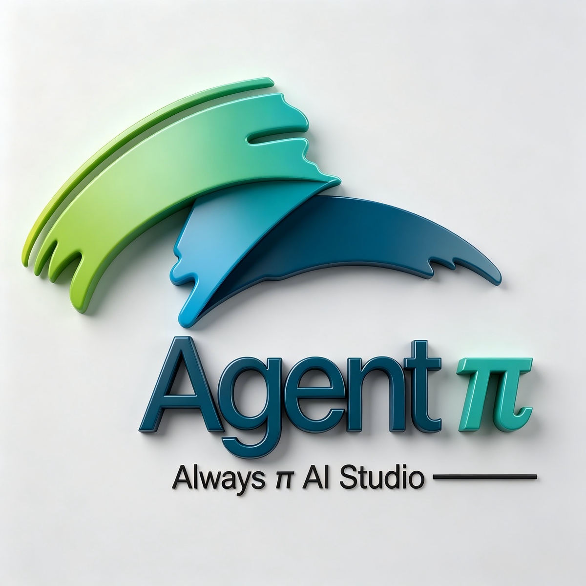
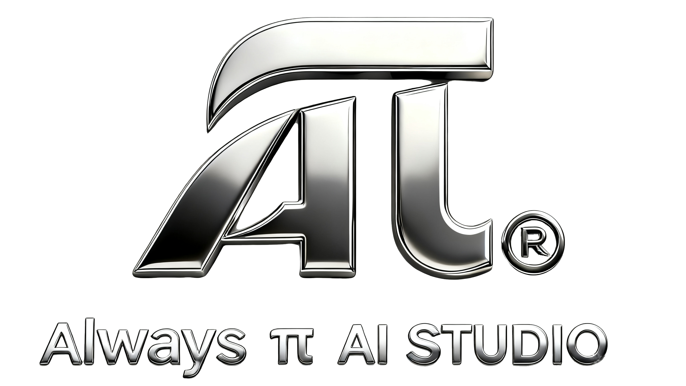

# Agent π / Agent Pi

<p align="center">
  
</p>

**中文** | Agent π 是基于 Craft Agents OSS 深度改造的 Windows 桌面智能体工作台，面向长周期项目分析、招投标文件处理、工程资料研究、多智能体协作和可追溯成果沉淀。

**English** | Agent Pi is a Windows desktop agent workbench forked and deeply adapted from Craft Agents OSS. It is designed for long-running project analysis, tender/document production, engineering research, multi-agent workflows, and traceable project outputs.

Agent π 的目标不是做一个普通聊天壳，而是把智能体升级为真实项目作业里的 **超级工作台**：主会话按工作目录组织，分支智能体折叠到主会话下，正式成果落回项目工作目录，过程文件可在应用内预览、编辑、导出，长任务由 Goal Loop 做自我审查和纠偏。

Agent Pi is not a thin chat wrapper. It is a project workbench: conversations are organized by working directory, spawned agents fold under the parent session, formal deliverables are written back to the project folder, files can be previewed/edited/exported inside the app, and Goal Loop reviews long tasks before accepting them as done.

## Latest Version / 最新版本

**Current release: V1.2.0. Next active development line: V1.2.1.**

**当前发布版：V1.2.0。下一阶段开发线：V1.2.1。**

GitHub Releases / 发布页:

[https://github.com/xiangxin2021cn/agent-pi/releases](https://github.com/xiangxin2021cn/agent-pi/releases)

## V1.2.0 Update / V1.2.0 更新

| Area / 模块 | English | 中文 |
| --- | --- | --- |
| Unified preview | File links opened from chat, attachments, and right-side outputs now share consistent preview actions. Markdown sidecars can be edited and exported to MD/PDF/DOCX. | 对话、附件和右侧输出文件的预览入口统一；带 Markdown 伴随文件时，可编辑并导出 MD/PDF/DOCX。 |
| AI rewrite in editor | Editable Markdown previews support selecting text, asking the active session to rewrite it with project memory context, previewing the replacement, and applying it back to the selected range. | Markdown 编辑状态支持选中文字后调用当前会话智能体改写，继承项目记忆，预览后回填到原选择位置。 |
| MinerU | MinerU precision extraction is bundled as an optional PDF/scanned-document enhancement. It is off by default and only runs when the workspace switch is enabled and a workspace-scoped token exists. | MinerU 作为可选 PDF/扫描件精确识别增强随包提供；默认关闭，必须工作区显式开启且配置 token 后才会运行。 |
| AnySearch MCP | AnySearch MCP is available as a recommended search connector. It installs disabled and unauthenticated; saving an API key does not silently enable it. | AnySearch MCP 作为推荐搜索连接器预置；安装后仍为禁用且未认证，保存 API key 也不会静默启用。 |
| Folder attachments | Selecting a folder now sends a path-only local folder reference instead of uploading every file under it. | 选择上传文件夹时只传本地绝对路径引用，不再递归上传文件夹下所有文件。 |
| Spawned agents | Sub-agents inherit the parent session working directory unless a working directory is explicitly supplied. | 分智能体默认继承父会话工作目录，不再误用工作区默认目录。 |
| Construction schedules | Added a project skill for generating Primavera P6 XML, Microsoft Project XML, and Candy General Importer-compatible planning artifacts from construction method statements and master programme text. | 新增施工进度计划 skill，可从施工方案、总计划文字生成 P6 XML、Microsoft Project XML 和 Candy General Importer 兼容计划文件。 |
| Runtime performance | Completed Pi-backed sessions release idle `pi-agent-server` Bun subprocesses after a short delay, reducing memory pressure when many sub-agents have finished. | Pi 会话完成后会延迟释放空闲 `pi-agent-server` Bun 子进程，减少大量分智能体完成后长期占用内存。 |

### Default-Off Guarantee / 默认关闭承诺

MinerU and AnySearch are **not enabled by default**. Token/API-key presence alone is not enough to activate either integration.

MinerU 和 AnySearch **默认不启用**。即使已经保存 token 或 API key，也不会自动开启；必须由用户在工作区或来源设置中显式启用。

## V1.2.1 Direction / V1.2.1 方向

V1.2.1 focuses on making Agent Pi a stronger document-production and knowledge-reuse workbench for professional project teams.

V1.2.1 将重点强化 Agent π 的专业文档创作、知识复用和行业化交付能力。

| Direction | English | 中文 |
| --- | --- | --- |
| Document Quality Composer | Detect report sections that deserve richer visual expression, then generate source-backed Markdown visuals, tables, diagrams, captions, and export-ready assets. | 自动识别适合用图表、流程图、表格、组织架构等表达的内容区块，生成有来源支撑、可复用、可导出的 Markdown 图文资产。 |
| Professional visuals | Add construction Gantt charts with WBS, baseline/current plan, progress line, critical path, milestones, legends, and A4/A3 landscape export options. Also expand investment, GIS, and simulation/CAE visual profiles. | 强化专业视觉表达：建筑施工甘特图支持 WBS、基线/当前计划、进度线、关键路径、里程碑、图例、A4/A3 横向导出；同时扩展投资、GIS、仿真/CAE 等垂直场景图表。 |
| Template fidelity | When a user uploads a reference template, audit the new output against its layout intent, heading structure, depth, figure/table conventions, and delivery format. | 用户上传参照模板后，严格审查新文件是否匹配页面布局意图、目录结构、内容深度、图表规范和交付格式。 |
| Evidence-rich Markdown | Improve how agents cite external search evidence, images, charts, screenshots, and source metadata inside `.md` deliverables. | 强化 `.md` 成果中外部资料、图片、图表、截图、来源链接、发布时间、作者/机构等证据引用。 |
| Knowledge Base | Add generated `.md`, `.txt`, and `.json` artifacts to a Knowledge Base MCP source from the right-side file panel, accept a suggested category/folder or type a custom one, and show it under Data Sources -> Knowledge Base. User selection is required before use. | 右侧产物文件可右键“加入知识库”，MVP 支持 `.md`、`.txt`、`.json`，创建时可接受推荐分类/文件夹或自定义输入，并自动出现在左侧“数据源 -> 知识库”；必须由用户选择后才启用。 |

Detailed planning:

- [V1.2.1 Document Quality Composer Plan](docs/superpowers/plans/2026-07-02-v1.2.1-document-quality-composer.md)
- [Future Engineering, BIM, And Construction Agent Framework](docs/research/future-engineering-bim-construction-agent-framework.md)

## V1.1.3 Update / V1.1.3 更新

V1.1.3 introduced a MoA-inspired quality review council for Goal Loop, task quality routing, Project Memory Lite reviewer telemetry, stronger self-correction prompts, recent-session recovery after restart, stable workspace-folder ordering, bundled Git for Windows 2.55.0, Pi SDK 0.80.3, Claude Agent SDK 0.3.197, Sonnet 5, and Bedrock route support.

V1.1.3 实验性引入 MoA 启发的质量评审 council、任务质量路由、Project Memory Lite 评审经验沉淀和自动纠偏增强；修复重启后最近会话丢失、展开工作文件夹跳顶；Windows 安装包集成 Git for Windows 2.55.0，Pi 升级到 0.80.3，Claude Agent SDK 升级到 0.3.197，并补充 Sonnet 5 与 Bedrock 路由支持。

## Version History / 版本更新

| Version | English | 中文 | Release |
| --- | --- | --- | --- |
| V1.2.0 | Unified file preview/edit/export, AI selection rewrite, optional MinerU extraction, optional AnySearch MCP setup, folder path-only attachments, spawned-agent working-directory inheritance, construction schedule skill, and idle Pi runtime cleanup. | 统一文件预览/编辑/导出、选中文本 AI 改写、可选 MinerU、可选 AnySearch MCP、文件夹路径引用、分智能体继承工作目录、施工进度计划 skill、Pi 空闲 runtime 清理。 | [v1.2.0](https://github.com/xiangxin2021cn/agent-pi/releases/tag/v1.2.0) |
| V1.1.3 | MoA-inspired quality review council, quality routing, Project Memory reviewer telemetry, session UI recovery, stable workspace ordering, bundled Git, SDK upgrades. | MoA 启发质量评审、多角色质量路由、项目记忆沉淀、会话资产修复、工作目录排序修复、打包 Git、SDK 升级。 | [v1.1.3](https://github.com/xiangxin2021cn/agent-pi/releases/tag/v1.1.3) |
| V1.1.2 | Task Contract and Document Plan for document-heavy workflows. | 新增 Task Contract 与 Document Plan，强化文档任务硬约束。 | [v1.1.2](https://github.com/xiangxin2021cn/agent-pi/releases/tag/v1.1.2) |
| V1.1.1 | Fixed native file/folder picker timeout behavior. | 修复文件、文件夹和工作目录选择 30 秒超时。 | [v1.1.1](https://github.com/xiangxin2021cn/agent-pi/releases/tag/v1.1.1) |
| V1.1.0 | Strengthened Goal Loop, Project Memory Lite, working-directory isolation, formal output previews, and prompt optimization routing. | 强化 Goal Loop、Project Memory Lite、工作目录隔离、正式输出预览和提示词优化模型路由。 | [v1.1.0](https://github.com/xiangxin2021cn/agent-pi/releases/tag/v1.1.0) |
| V1.0.0 | First major workbench release with Goal Loop, rendered Markdown editing, PDF/DOCX export, and long-task document quality guardrails. | 首个重大工作台版本：Goal Loop、渲染态 Markdown 编辑、PDF/DOCX 导出和长任务文档质量护栏。 | [v1.0.0](https://github.com/xiangxin2021cn/agent-pi/releases/tag/v1.0.0) |

## Core Capabilities / 核心能力

| Capability | English | 中文 |
| --- | --- | --- |
| Goal Loop | Reviews long-running tasks against the user's stated goal, required files, formats, evidence, and verification signals before accepting completion. | 按用户目标、必需文件、格式、证据和验证信号审查长任务结果，避免过早完成。 |
| Task Contract | Converts user instructions into a durable task contract with hard constraints, acceptance checks, evidence requirements, and forbidden shortcuts. | 将用户要求转成可持久化任务契约，记录硬约束、验收标准、证据要求和禁止偷懒项。 |
| Document Plan | Adds structure, audience, tone, section, table, chart, citation, and delivery-format expectations for document tasks. | 为文档任务提取标题、受众、语气、章节、表格、图表、引用和交付格式约束。 |
| Project Memory Lite | Stores local project facts, sources, citations, decisions, formal outputs, reviews, and quality telemetry under `.agent-pi/brain`. | 在 `.agent-pi/brain` 中沉淀来源、引用、决策、正式成果、审稿和质量经验。 |
| Working-directory isolation | Locks sessions to a physical working directory so project memory and outputs do not leak across projects. | 会话锁定物理工作目录，项目记忆和正式成果按项目隔离。 |
| Formal outputs | Promotes deliverables into `Agent Pi Outputs` and labels files as formal output, attachment, data file, or process artifact. | 将成果提升到 `Agent Pi Outputs`，并区分正式成果、附件、数据文件和过程文件。 |
| File preview | Opens Markdown, text, code, JSON, PDF, Office, Excel, image, and sidecar Markdown previews inside the app where possible. | 在应用内预览 Markdown、文本、代码、JSON、PDF、Office、Excel、图片及 Markdown 伴随文件。 |
| Multi-agent sessions | Spawns sub-agents for parallel work while keeping them folded under the parent task and project directory. | 支持分智能体并行处理，并折叠到主会话和项目目录下。 |

## User Manual / 用户手册

Read the manual before using Agent Pi on production project work:

真实项目落地前建议先阅读用户手册：

[docs/USER_MANUAL.md](docs/USER_MANUAL.md)

The manual covers installation, Workspace, working directories, session folding, model switching, file preview, formal outputs, sources, skills, automations, and troubleshooting.

手册覆盖 Windows 安装、Workspace、工作目录、会话折叠、模型切换、文件预览、正式输出、数据源、技能、自动化和常见问题处理。

## Download / 下载

Windows x64 installers are published from GitHub Releases after validation:

Windows x64 安装包会在验证通过后发布到 GitHub Releases：

[https://github.com/xiangxin2021cn/agent-pi/releases/latest](https://github.com/xiangxin2021cn/agent-pi/releases/latest)

Release assets / 发布资产:

- `Agent-Pi-x64.exe`
- `Agent-Pi-x64.exe.blockmap`
- `latest.yml`

## Roadmap / 未来路线

Agent Pi will continue moving from a general AI desktop toward a vertical professional agent workbench. The long-term direction is not just chatting with files, but producing auditable, editable, source-grounded project artifacts.

Agent π 将从通用 AI 桌面应用继续向垂直专业智能体工作台演进。长期目标不是“和文件聊天”，而是持续生成可审查、可编辑、有来源、有过程记忆的项目成果。

Future directions include:

- Construction and tender intelligence: PDF drawing recognition, OCR/vector extraction, BOQ reconciliation, quantity takeoff, construction planning, cost-loaded schedules, and highway/civil tender workflows.
- Engineering and BIM workflows: road/corridor data models, IFC/GeoJSON/LandXML-style intermediate data, Blender/Bonsai/IfcOpenShell visualization, 4D progress views, and model-backed report figures.
- Professional document automation: Word/PDF/DOCX output quality, strict template matching, evidence-rich Markdown, visual asset generation, and export verification.
- Enterprise knowledge: local-global knowledge MCPs first, then team/network knowledge bases, permission governance, category management, and reusable company standards.
- Domain-specific intelligence: investment analysis, GIS reporting, simulation/ANSYS/CAE post-processing, legal/compliance review, and other vertical expert workflows.
- Agent self-improvement: stronger Goal Loop audits, self-correction, reviewer telemetry, MoA-style quality review, and weaker/private model enhancement through tools and structured workflows.

未来重点包括：

- 施工与投标智能：PDF 图纸识别、OCR/矢量提取、BOQ 对照、工程量拆分、施工策划、成本加载进度计划、公路/市政投标工作流。
- 工程与 BIM：道路/廊道数据模型、IFC/GeoJSON/LandXML 类中间数据、Blender/Bonsai/IfcOpenShell 可视化、4D 进度展示、模型驱动报告图。
- 专业文档自动化：Word/PDF/DOCX 成果质量、严格模板匹配、有证据的 Markdown、专业图表资产生成和导出校验。
- 知识库：先做本机全局知识 MCP 和 Obsidian 式分类/文件夹管理，再扩展团队/联网知识库、权限治理、分类管理和企业标准复用。
- 垂直领域智能：投资分析、GIS 报告、仿真/ANSYS/CAE 后处理、法律合规审查以及更多行业专家工作流。
- 智能体自我改进：更强 Goal Loop 审计、自我纠偏、评审经验沉淀、MoA 式质量评审，以及通过工具和结构化流程增强弱模型/私有化模型。

## Collaboration / 合作共建

Agent Pi is open to collaboration with vertical-domain experts, engineers, researchers, builders, and teams who want to turn agent workflows into real production systems. We especially welcome contributors in construction management, quantity surveying, tendering, BIM/GIS, structural simulation, investment analysis, knowledge-base management, document automation, MCP tooling, and agent runtime engineering.

Agent π 欢迎垂直领域专家、工程师、研究者、开发者和团队共同参与，把智能体工作流真正做成可落地的生产系统。特别欢迎施工管理、工程造价、招投标、BIM/GIS、结构仿真、投资分析、知识库管理、文档自动化、MCP 工具和智能体运行时方向的伙伴加入。

If you have domain datasets, repeatable workflows, industry standards, validation cases, or specialized tools, you can help shape Agent Pi into a practical vertical agent platform.

如果你有行业数据、可复用流程、专业规范、验证案例或专用工具，欢迎一起把 Agent π 拓展成真正面向专业场景的垂直智能体平台。

## Development / 开发

Install dependencies / 安装依赖:

```bash
bun install
```

Run checks / 运行检查:

```bash
bun run typecheck:all
bun run lint
```

Build a local Windows installer without uploading to GitHub / 本地生成 Windows 安装包但不上传 GitHub:

```powershell
cd apps/electron
powershell -ExecutionPolicy Bypass -File scripts\build-win.ps1
```

Output / 产物位置:

```text
apps/electron/release/Agent-Pi-x64.exe
```

Use `-KillLockingProcesses` only when you intentionally want the build script to close local development Electron/Node processes.

只有明确需要关闭本地开发 Electron/Node 锁文件进程时，才添加 `-KillLockingProcesses`。

## License / 许可证

Apache-2.0. See [LICENSE](LICENSE).

## Copyright And Contact / 版权与联系

<p align="center">
  
</p>

© 2026 Always π AI Studio. Agent π is released under the Apache-2.0 license.

Author / Maintainer / 作者维护者：567601@qq.com
