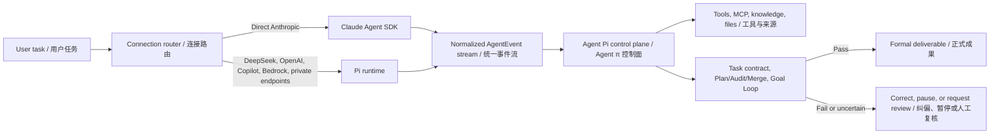

# Agent π / Agent Pi

<p align="center">
  
</p>

**中文** | Agent π 是基于 Craft Agents OSS 深度改造的 Windows 桌面智能体工作台，面向长周期项目分析、招投标文件处理、工程资料研究、多智能体协作和可追溯成果沉淀。

**English** | Agent Pi is a Windows desktop agent workbench forked and deeply adapted from Craft Agents OSS. It is designed for long-running project analysis, tender/document production, engineering research, multi-agent workflows, and traceable project outputs.

Agent π 的目标不是做一个普通聊天壳，而是把智能体升级为真实项目作业里的 **超级工作台**：主会话按工作目录组织，分支智能体折叠到主会话下，正式成果落回项目工作目录，过程文件可在应用内预览、编辑、导出，长任务由 Goal Loop 做自我审查和纠偏。

Agent Pi is not a thin chat wrapper. It is a project workbench: conversations are organized by working directory, spawned agents fold under the parent session, formal deliverables are written back to the project folder, files can be previewed/edited/exported inside the app, and Goal Loop reviews long tasks before accepting them as done.

## Dual Runtime, One Control Plane / 双运行时、统一控制面

Agent Pi's execution strength comes from **Claude Agent SDK or Pi as the model runtime, plus Agent Pi's own provider-independent control plane**. Claude Agent SDK and Pi both contribute to the product, but they do not normally generate the same turn together: one turn uses one selected LLM connection and one backend. This is a dual-runtime architecture, not an implicit mixture-of-agents.

Agent π 的强执行能力来自 **Claude Agent SDK 或 Pi 模型运行时，加上 Agent π 自有的、与模型供应商无关的统一控制面**。Claude Agent SDK 与 Pi 都是产品能力的重要基础，但通常不会在同一轮共同生成答案：每轮只使用一个选定的 LLM 连接和一个后端。这是“双运行时架构”，并不等同于默认启用多模型混合推理。



| Layer / 层 | English | 中文 |
| --- | --- | --- |
| Claude Agent SDK runtime | Direct Anthropic connections use Claude-native streaming, tool execution, hooks, session continuation, and model lifecycle semantics. | Anthropic 直连使用 Claude 原生流式响应、工具执行、Hooks、会话延续和模型生命周期语义。 |
| Pi runtime | DeepSeek, OpenAI/Codex, GitHub Copilot, Bedrock, compatible endpoints, and private models use Pi's unified provider layer, isolated agent subprocess with JSONL RPC, steering, retry, and context-compaction handling. | DeepSeek、OpenAI/Codex、GitHub Copilot、Bedrock、兼容端点和私有模型使用 Pi 的统一供应商层、通过 JSONL RPC 通信的隔离智能体子进程、动态引导、重试和上下文压缩处理。 |
| Normalized event contract | Backend-specific messages, tool calls, results, usage, errors, and terminal signals are converted into one `AgentEvent` stream. | 不同后端的消息、工具调用、结果、用量、错误和终态信号被转换为统一的 `AgentEvent` 事件流。 |
| Agent Pi control plane | A shared `SessionManager` applies source boundaries, permissions, working-directory isolation, MCP/API tools, task contracts, governed sub-agents, transactional artifacts, Plan/Audit/Merge, Goal Loop, and document-quality checks. | 统一 `SessionManager` 负责来源硬边界、权限、工作目录隔离、MCP/API 工具、任务契约、受控子智能体、事务化成果、Plan/Audit/Merge、Goal Loop 和文档质量检查。 |

`@anthropic-ai/sdk` is the lower-level Anthropic API client dependency; the Claude agent loop described above is provided by `@anthropic-ai/claude-agent-sdk`. / `@anthropic-ai/sdk` 是底层 Anthropic API 客户端依赖；上述 Claude 智能体循环由 `@anthropic-ai/claude-agent-sdk` 提供。

The runtime first lets the selected model reason and call tools; Agent Pi then decides whether the task is actually complete. A backend `complete` event only means that the model turn stopped. Formal completion still requires application-level evidence, output, format, source, and quality gates to pass. If a gate fails, Agent Pi can continue correction, pause for confirmation, or move the task to review.

运行时先让所选模型推理并调用工具，随后由 Agent π 判断任务是否真正完成。后端发出 `complete` 只代表模型本轮停止，并不代表任务已经合格；正式完成仍须通过应用层的证据、产物、格式、来源和质量门禁。门禁失败时，Agent π 可以继续纠偏、暂停等待确认，或把任务转入待审查。

This separation allows the same enterprise workflow to run on Anthropic models, DeepSeek, compatible domestic models, or privately deployed endpoints without rewriting business logic. It improves bounded autonomy for weaker models, but it does not erase model capability differences: professional accuracy still depends on authoritative sources, deterministic tools, verification, and human approval where required.

这种分层让同一套企业工作流可以运行在 Anthropic、DeepSeek、兼容国产模型或私有化端点上，而无需重写业务逻辑；它能提升较弱模型的受控自治能力，但不会消除模型本身的能力差异。专业准确性仍然依赖权威来源、确定性工具、校验以及必要的人工批准。

## Latest Version / 最新版本

**Current release: V2.2.6.**

**当前发布版：V2.2.6。**

GitHub Releases / 发布页:

[https://github.com/xiangxin2021cn/agent-pi/releases](https://github.com/xiangxin2021cn/agent-pi/releases)

## Recent Changes / 最近三次变更

### V2.2.6 Multi-Agent Recovery and DeepSeek V4 Endpoint Limits / V2.2.6 多智能体恢复与 DeepSeek V4 端点上限

V2.2.6 keeps Tender Workbench multi-agent runs bounded without turning failures into permanent deadlocks. Parent sessions still wait while child agents are actively processing, but failed, stale, or missing child handoffs now move into a recoverable state: retry the child, ask the user, or continue with explicit missing-child gaps. This hotfix also prevents a queued parent recovery instruction from being re-queued behind the same failed-child review barrier, which caused repeated "waiting for structured child handoff" loops. Parent sessions remain blocked from fabricating child-owned report files. Custom endpoint models named `deepseek-v4`, `deepseek-v4-pro`, `deepseek-v4-flash`, `deepseek-chat`, or `deepseek-reasoner` now register with 1M context and 384K max output defaults, with manual override syntax such as `deepseek-v4-pro@ctx=1000000@out=384000`.

V2.2.6 保持投标工作台多智能体边界，但不再把失败变成永久死锁。子智能体仍在运行时主会话继续等待；子智能体失败、超时或未写出 handoff 时，会进入可恢复状态：重试子任务、询问用户，或在明确记录缺失项后继续。本次热修还阻止主会话恢复指令被重新排到同一个失败子任务复核屏障后面，避免反复刷出“等待结构化 handoff”的循环。主会话仍禁止伪造子智能体专属报告文件。自定义端点模型名为 `deepseek-v4`、`deepseek-v4-pro`、`deepseek-v4-flash`、`deepseek-chat` 或 `deepseek-reasoner` 时，默认注册 100 万上下文和 38.4 万最大输出，并支持 `deepseek-v4-pro@ctx=1000000@out=384000` 形式的手动覆盖。

| Area / 模块 | English | 中文 |
| --- | --- | --- |
| Handoff recovery | Active children keep ownership; failed or missing child reports unblock into explicit recovery instead of infinite waiting. | 运行中的子智能体继续拥有任务；失败或缺失报告会解除无限等待，进入显式恢复。 |
| Report ownership | Parent sessions still cannot create, edit, or replace child-owned handoff report paths. | 主会话仍不能创建、修改或替换子智能体专属 handoff 报告路径。 |
| DeepSeek V4 endpoints | Known DeepSeek V4 custom model IDs receive 1M context and 384K output defaults; custom overrides can be typed in the model field. | 已知 DeepSeek V4 自定义模型自动获得 100 万上下文与 38.4 万输出默认值；模型输入框支持手动覆盖。 |
| Core runtime | Claude Agent SDK 0.3.214, Anthropic SDK 0.112.3, and Pi 0.80.10. | Claude Agent SDK 升级至 0.3.214，Anthropic SDK 升级至 0.112.3，Pi 保持最新的 0.80.10。 |

### V2.2.5 Stability and Responsiveness / V2.2.5 稳定性与流畅性

V2.2.5 focuses on keeping large Tender Workbench sessions responsive. The session file panel now uses shallow initial scans and loads folder children only when expanded, so large Official Outputs and document-artifact trees no longer trigger full recursive scans on every refresh. Production builds also write an always-on `stability.log` for renderer exits, child-process exits, unresponsive transitions, uncaught exceptions, and memory peaks. Automation services stay dormant unless a workspace actually has `automations.json`, and startup permission reconciliation is scoped to active or explicitly non-default sessions.

V2.2.5 聚焦大型投标工作台会话的稳定性和流畅性。会话文件面板改为初始浅扫，只有展开文件夹时才加载子项，避免大型 Official Outputs 和 document-artifact 树在每次刷新时全量递归扫描。发布版新增常驻 `stability.log`，记录 renderer 退出、子进程退出、无响应转换、未捕获异常和内存峰值。自动化服务仅在工作区确实存在 `automations.json` 时启动，启动阶段权限校准也缩小到活动或显式非默认会话。

| Area / 模块 | English | 中文 |
| --- | --- | --- |
| Lazy file tree | Initial session-file loading is shallow; folder children are fetched only on expand, with path-boundary checks. | 初始会话文件加载只做浅扫；展开文件夹时才读取子项，并带路径边界检查。 |
| Stability diagnostics | `~/.agent-pi/logs/stability.log` records renderer crashes, child-process exits, unresponsive/responsive events, exceptions, rejections, and memory peaks. | `~/.agent-pi/logs/stability.log` 记录 renderer 崩溃、子进程退出、卡死/恢复、异常、Promise 拒绝和内存峰值。 |
| Lower idle load | Automation runtime starts only when configured; permission reconciliation no longer scans every session by default. | 自动化运行时仅在配置存在时启动；权限状态校准不再默认扫描全部会话。 |
| Regression tests | Added lazy-loading and stability telemetry coverage; watcher tests match the safer debounce window. | 增加懒加载和稳定性遥测测试；watcher 测试匹配更稳妥的 debounce 窗口。 |

### V2.2.4 C5.1 BOQ Pricing and Bidder Commitments / V2.2.4 C5.1 组价与投标人条件确认

V2.2.4 makes the C5.1 item-level workpaper the readiness standard for Tender Workbench BOQ pricing. Each item must retain its original BOQ identity and sources, define scope and payment rules, derive crew and three-scenario productivity, calculate resource consumption, apply traceable VAT-exclusive rates, and reconcile pure direct unit cost and item total. Backend-controlled batches are limited to 12 items and reject generic databases or summary reports as substitutes. A new user-confirmed bidder-commitment stage binds proposed resources, procurement, camp, method, productivity, sequence, timing, and subcontract decisions before methodology planning. The release also fixes persistent child-session unread indicators, focuses the primary navigation, and refreshes the Claude and Pi runtimes.

V2.2.4 将 C5.1 逐项工作底稿设为投标工作台 BOQ 组价的就绪标准。每条清单必须保留原始身份及来源，明确范围和计量支付规则，推导班组及三情景工效，核算资源消耗，采用可追溯且不含增值税的费率，并校核纯直接费单价与条目总价。后端受控批次最多 12 条，通用人材机数据库或摘要报告不能替代逐项推导。新增由用户确认的“投标人条件”阶段，在施工策划前锁定拟投入资源、采购、营地、工法、工效、顺序、时间和分包决策。本版同时修复子会话未读状态反复出现的问题、精简主导航并更新 Claude 与 Pi 运行时。

| Area / 模块 | English | 中文 |
| --- | --- | --- |
| C5.1 BOQ pricing | Structured item identity, scope clauses, crew and bottleneck productivity, six resource categories, rate metadata, pure direct-cost arithmetic, and item-specific risk are mandatory. | 强制校验条目身份、范围条款、班组与瓶颈工效、六类资源、费率元数据、纯直接费计算和条目特定风险。 |
| Controlled batches | At most 12 immutable BOQ items per child brief; full coverage, schema, arithmetic, source, and cross-batch conflict gates must pass before merge. | 每份子智能体简报最多包含 12 条不可变清单；合并前必须通过全覆盖、结构、算术、来源及跨批次冲突门禁。 |
| Bidder commitments | User-confirmed labour, management, equipment, material-price, camp, method, productivity, sequence, timing, and subcontract decisions gate construction methodology. | 用户确认的人力、管理、设备、材料价格、营地、工法、工效、顺序、时间和分包决策成为施工策划前置门禁。 |
| Thread-aware read state | Parent and descendant sessions share a consistent read boundary, including child completion while the parent is being viewed. | 主会话与全部后代会话采用一致的已读边界，包括查看主会话期间完成的子智能体。 |
| Focused navigation | Scheduled tasks, event triggers, and agent events are removed from the main sidebar; existing automation data and backend services are not deleted. | 主侧栏不再显示定时任务、事件触发和智能体事件；已有自动化数据及后端服务不会被删除。 |
| Core runtime | Claude Agent SDK 0.3.212, Anthropic SDK 0.112.2, and Pi 0.80.10. | Claude Agent SDK 升级至 0.3.212，Anthropic SDK 升级至 0.112.2，Pi 升级至 0.80.10。 |

Older release details are available on GitHub Releases.

更早版本说明请查看 GitHub Releases。

## Core Capabilities / 核心能力

| Capability | English | 中文 |
| --- | --- | --- |
| Goal Loop | Reviews long-running tasks against the user's stated goal, required files, formats, evidence, and verification signals before accepting completion. | 按用户目标、必需文件、格式、证据和验证信号审查长任务结果，避免过早完成。 |
| Task Contract | Converts user instructions into a durable task contract with hard constraints, acceptance checks, evidence requirements, and forbidden shortcuts. | 将用户要求转成可持久化任务契约，记录硬约束、验收标准、证据要求和禁止偷懒项。 |
| Requirement Ledger | Tracks each material requirement with a stable ID, verification rule, status, evidence references, and failure reason across follow-up turns. | 跨后续轮次以稳定 ID、验证规则、状态、证据引用和失败原因追踪每项关键要求。 |
| Transactional Document Artifact | Writes long Markdown as recoverable sections and accepts completion only after hash-frozen atomic assembly and validation. | 将长 Markdown 写成可恢复章节，仅在冻结哈希、原子组装并校验后接受完成。 |
| Document Plan | Adds structure, audience, tone, section, table, chart, citation, and delivery-format expectations for document tasks. | 为文档任务提取标题、受众、语气、章节、表格、图表、引用和交付格式约束。 |
| Project Memory Lite | Stores local project facts, sources, citations, decisions, formal outputs, reviews, and quality telemetry under `.agent-pi/brain`. | 在 `.agent-pi/brain` 中沉淀来源、引用、决策、正式成果、审稿和质量经验。 |
| Enterprise Knowledge Base | Promotes local files into stable file-memory MCP knowledge sources with category/folder metadata and explicit user activation. | 将本地文件提升为稳定 file-memory MCP 知识源，带分类/文件夹元数据，并要求用户显式启用。 |
| Working-directory isolation | Locks sessions to a physical working directory so project memory and outputs do not leak across projects. | 会话锁定物理工作目录，项目记忆和正式成果按项目隔离。 |
| Formal outputs | Promotes deliverables into `Agent Pi Outputs` and labels files as formal output, attachment, data file, or process artifact. | 将成果提升到 `Agent Pi Outputs`，并区分正式成果、附件、数据文件和过程文件。 |
| File preview | Opens Markdown, text, code, JSON, PDF, Office, Excel, image, and sidecar Markdown previews inside the app where possible. | 在应用内预览 Markdown、文本、代码、JSON、PDF、Office、Excel、图片及 Markdown 伴随文件。 |
| Multi-agent sessions | Spawns sub-agents for parallel work while keeping them folded under the parent task and project directory. | 支持分智能体并行处理，并折叠到主会话和项目目录下。 |

## Download / 下载

Installers are published from GitHub Releases after validation:

安装包会在验证通过后发布到 GitHub Releases：

[https://github.com/xiangxin2021cn/agent-pi/releases/latest](https://github.com/xiangxin2021cn/agent-pi/releases/latest)

Release assets / 发布资产:

- Windows x64: `Agent-Pi-x64.exe`, `Agent-Pi-x64.exe.blockmap`, `latest.yml`
- macOS Apple Silicon: `Agent-Pi-arm64.dmg`, `Agent-Pi-arm64.zip`
- macOS Intel: `Agent-Pi-x64.dmg`, `Agent-Pi-x64.zip`, shared `latest-mac.yml`
- Linux x64: `Agent-Pi-x64.AppImage`, `latest-linux.yml`

## User Manual / 用户手册

Read the manual before using Agent Pi on production project work:

真实项目落地前建议先阅读用户手册：

[docs/USER_MANUAL.md](docs/USER_MANUAL.md)

The manual covers installation, Workspace, working directories, session folding, model switching, file preview, formal outputs, sources, skills, automations, and troubleshooting.

手册覆盖 Windows 安装、Workspace、工作目录、会话折叠、模型切换、文件预览、正式输出、数据源、技能、自动化和常见问题处理。

## Roadmap / 未来路线

Agent Pi will continue moving from a general AI desktop toward a vertical professional agent workbench. The long-term direction is not just chatting with files, but producing auditable, editable, source-grounded project artifacts.

Agent π 将从通用 AI 桌面应用继续向垂直专业智能体工作台演进。长期目标不是“和文件聊天”，而是持续生成可审查、可编辑、有来源、有过程记忆的项目成果。

Future directions include:

- Construction and tender intelligence: PDF drawing recognition, OCR/vector extraction, BOQ reconciliation, quantity takeoff, construction planning, cost-loaded schedules, and highway/civil tender workflows.
- Engineering and BIM workflows: road/corridor data models, IFC/GeoJSON/LandXML-style intermediate data, Blender/Bonsai/IfcOpenShell visualization, 4D progress views, and model-backed report figures.
- Professional document automation: Word/PDF/DOCX output quality, strict template matching, structured evidence matrices, evidence-rich Markdown, visual asset generation, export verification, and Agent Pi's document workflow quality modes.
- Multi-agent document production: chapter-agent assignments, role review, final synthesis ownership, and cross-chapter consistency checks for large tenders, engineering reports, investment reports, and due diligence.
- Enterprise knowledge: local-global knowledge MCPs first, then team/network knowledge bases, permission governance, category management, and reusable company standards.
- Domain-specific intelligence: investment analysis, GIS reporting, simulation/ANSYS/CAE post-processing, legal/compliance review, and other vertical expert workflows.

未来重点包括：

- 施工与投标智能：PDF 图纸识别、OCR/矢量提取、BOQ 对照、工程量拆分、施工策划、成本加载进度计划、公路/市政投标工作流。
- 工程与 BIM：道路/廊道数据模型、IFC/GeoJSON/LandXML 类中间数据、Blender/Bonsai/IfcOpenShell 可视化、4D 进度展示、模型驱动报告图。
- 专业文档自动化：Word/PDF/DOCX 成果质量、严格模板匹配、结构化证据矩阵、有证据的 Markdown、专业图表资产生成、导出校验，以及 Agent π 自有的文档工作流质量模式。
- 多智能体文档生产：面向大型投标、工程报告、投资报告和尽调任务的章节智能体分工、多角色评审、最终合成负责人和跨章节一致性检查。
- 知识库：先做本机全局知识 MCP 和分类/文件夹管理，再扩展团队/联网知识库、权限治理、分类管理和企业标准复用。
- 垂直领域智能：投资分析、GIS 报告、仿真/ANSYS/CAE 后处理、法律合规审查以及更多行业专家工作流。

## Collaboration / 合作共建

Agent Pi welcomes vertical-domain experts, engineers, researchers, builders, and teams who want to turn agent workflows into real production systems. We especially welcome contributors in construction management, quantity surveying, tendering, BIM/GIS, structural simulation, investment analysis, knowledge-base management, document automation, MCP tooling, and agent runtime engineering.

Agent π 欢迎垂直领域专家、工程师、研究者、开发者和团队共同参与，把智能体工作流真正做成可落地的生产系统。特别欢迎施工管理、工程造价、招投标、BIM/GIS、结构仿真、投资分析、知识库管理、文档自动化、MCP 工具和智能体运行时方向的伙伴加入。

## Development / 开发

Install dependencies / 安装依赖:

```bash
bun install
```

Run checks / 运行检查:

```bash
bun run typecheck:all
bun run lint
```

Build a local Windows installer without uploading to GitHub / 本地生成 Windows 安装包但不上传 GitHub:

```powershell
cd apps/electron
powershell -ExecutionPolicy Bypass -File scripts/build-win.ps1
```

## License / 许可证

Apache-2.0
