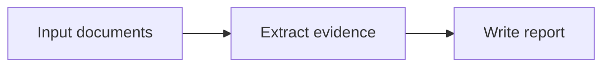

# Document Visuals And Template Fidelity

Agent Pi can enrich professional Markdown deliverables with diagrams, tables, schedules, maps, and evidence-backed figure blocks. These features are conservative by design: the app should generate a visual only when the task and source data support it.

## When Visuals Are Generated

Visuals are considered when a document task contains evidence such as:

- activities, dates, milestones, WBS codes, or progress data;
- cost, quantity, period, return, risk, or scenario tables;
- coordinates, routes, chainage, boundaries, or GeoJSON;
- simulation residuals, load cases, result values, units, or solver exports;
- process steps, role hierarchy, responsibility matrices, or risk scoring.

If the source data is missing, the expected behavior is a missing-input table or audit issue, not an invented chart.

## Mermaid Vs Professional Assets

Use Mermaid when the visual should stay editable in Markdown:

````markdown

````

Use a professional SVG/PNG asset when the figure must survive PDF/DOCX export or carry dense domain detail:

```markdown


**Figure 2. Construction schedule by WBS.**  
Source: schedule-data.json, BOQ package split, data date 2026-07-03.  
Audit: rendered as A3 landscape because the schedule is too dense for ordinary Mermaid Gantt.
```

During export, Mermaid blocks can be rendered to stable SVG assets while the source Markdown remains editable.

## Construction Schedule Figures

For construction, tender, and progress documents, Agent Pi prefers professional schedule figures when the data supports them.

A professional schedule figure should include:

- WBS groups;
- baseline and current plan bars;
- progress/data date;
- critical path;
- milestones;
- percent complete where available;
- legend and source note;
- A4 landscape or A3 landscape page intent.

Use A3 landscape for dense schedules, route/corridor appendices, and construction packages that would be unreadable on A4.

## Investment Tables And Charts

Investment and feasibility visuals must preserve:

- currency;
- period;
- gross/net basis;
- scenario name;
- benchmark or discount-rate assumption;
- source file or external source.

Recommended outputs include assumption tables, NPV/IRR summaries, cash-flow tables, waterfall charts, sensitivity matrices, and cumulative cash-flow curves. Values may be rounded for display, but raw values and assumptions should stay in a sidecar file or appendix.

## GIS And Route Figures

Maps and route visuals must include:

- title;
- legend;
- scale note or scale bar;
- CRS or CRS warning;
- source;
- retrieval/export date;
- confidence note if coordinates are approximate.

If coordinates or CRS are missing, use an evidence table instead of a misleading map.

## Simulation And ANSYS/CAE Figures

Simulation visuals must include engineering context:

- solver/source;
- load case;
- result component;
- units;
- coordinate system;
- timestep/frequency if applicable;
- min/max or value range when available.

If only screenshots are available, include screenshot provenance. If native solver files are supplied without a supported parser, ask for exported CSV/images instead of pretending to parse them.

## Strict Template Mode

When a user uploads a reference template and asks to preserve its layout, Agent Pi should treat Markdown as the semantic draft and template metadata as a code-level rendering constraint.

What Markdown can preserve:

- heading hierarchy;
- section order;
- tables;
- figure references;
- citations;
- template profile ID;
- writing depth and conventions.

What requires DOCX/OOXML rendering:

- exact page margins;
- header/footer replication;
- Word style IDs;
- numbering definitions;
- table styles;
- font and paragraph properties;
- page breaks and section properties.

PDF templates support visual approximation only. For strict Word-level fidelity, provide the original `.docx` template when possible.

## Knowledge Base Sources

Generated artifacts and imported files can be promoted into the Knowledge Base from the right-side file panel or the Knowledge Base add-file action.

The MVP behavior is:

1. Right-click a supported artifact or add a file from Data Sources -> Knowledge Base.
2. Choose Add to Knowledge Base or Add knowledge file.
3. Accept the suggested category/folder or type a custom folder path.
4. The app copies the file into stable app-level Knowledge Base storage.
5. Non-Markdown source formats are converted into structured Markdown before indexing when possible.
6. The app creates a disabled file-memory MCP source with knowledge-base metadata.
7. The source appears under Data Sources -> Knowledge Base and is listed in the Knowledge Base index.
8. The user explicitly loads, enables, or selects it before the agent can use it.

Knowledge Base sources are separate from Project Memory Lite. They are reusable sources, not automatic hidden memory.

## Figure Template

Use this Markdown shape for evidence-backed figures:

```markdown


**Figure N. Caption.**  
Evidence: explain how the figure supports the claim.  
Source: file title, path or URL, organization/author, publication or extraction date.  
Audit: note assumptions, missing fields, or export page intent.
```

## Validation Checklist

Before accepting a professional deliverable:

- Every figure has a caption.
- Every figure has a source note.
- Every numeric visual has units.
- Every time-based chart has period/date context.
- Every map has CRS/source/date or an explicit warning.
- Every simulation figure has solver/load case/component/units.
- Every strict-template claim has template-profile evidence.
- Every local image path resolves during export.
- Missing data is reported instead of invented.
