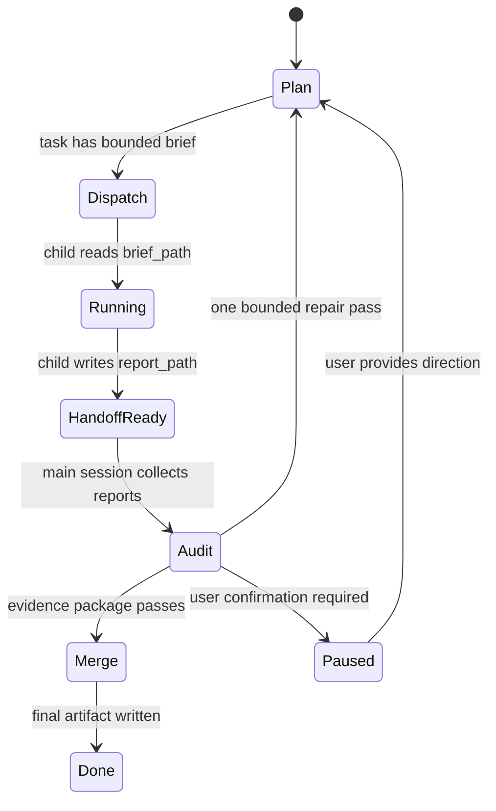

# Agent Pi Bounded Autonomy Design

Status: V2.0.1 bounded-dispatch MVP released. V2.1 Document Delivery Kernel implemented and regression-verified for the release candidate.

## 1. Problem

V2.0 introduced Plan/Audit/Merge, task board state, entropy signals, selected-source hard boundaries, and sub-agent lifecycle records. Field testing showed one remaining failure mode: complex document tasks can still drift when a sub-agent receives too much parent context, or when Goal Audit reconstructs the run by scanning conversation history and the working directory.

The bounded-autonomy direction is to make every autonomous step file-backed and narrow:

- the main session owns the task board and final merge;
- sub-agents receive a small brief file, allowed sources, and a report path;
- evidence packages summarize the run for audit;
- a progress ledger exposes the current task, completed work, blocked items, user-confirmation needs, and entropy warnings.

## 2. V2.0.1 MVP

Implemented as a small step:

- `orchestration/briefs/`
- `orchestration/reports/`
- `orchestration/evidence-packages/`
- `orchestration/progress-ledger.json`

Sub-agent dispatch now externalizes the full prompt into a brief file. The child prompt contains only:

- `brief_path`
- `allowed_sources`
- `report_path`
- `evidence_packages_path`

Goal Audit writes an `orchestration_evidence_package` before model review and includes that path in audit evidence. The Info popover now has a ledger row with current task, completed count, blocked/review state, user-confirmation state, and evidence package path.

## 3. V2.1 Data Structures

### Orchestration State

```ts
interface SessionOrchestrationState {
  version: 1
  phase: 'plan' | 'audit' | 'merge' | 'paused' | 'done'
  policy: SessionOrchestrationPolicy
  taskBoard: { tasks: SessionOrchestrationTask[] }
  subAgents: SessionSubAgentLifecycleEntry[]
  artifacts?: SessionOrchestrationArtifactPaths
  ledger?: SessionOrchestrationProgressLedger
  entropy?: SessionOrchestrationEntropySignal
}
```

### Artifact Paths

```ts
interface SessionOrchestrationArtifactPaths {
  rootPath: string
  briefsPath: string
  reportsPath: string
  evidencePackagesPath: string
  progressLedgerPath: string
}
```

### Progress Ledger

```ts
interface SessionOrchestrationProgressLedger {
  currentTaskId?: string
  pending: number
  running: number
  handoffReady: number
  completed: number
  needsReview: number
  blocked: number
  cancelled: number
  needsUserConfirmation: boolean
  evidencePackagePath?: string
  updatedAt: number
}
```

### Sub-Agent Brief

The brief is Markdown for readability and tool compatibility:

```md
# Spawned Agent Brief

task_id: chapter-1-agent
allowed_sources: file-memory-chapter-1
report_path: .../orchestration/reports/chapter-1-agent.md

## Scope
Only analyze selected COTO Chapter 1.

## Forbidden Actions
- Do not scan the working directory.
- Do not use unselected sources.
- Do not spawn child sessions.
- Do not write final synthesis artifacts.

## Required Handoff
- task_id: ...
- sources_used: ...
- evidence: ...
- artifacts: ...
- gaps: ...
- recommendation: ...
```

### Evidence Package

Evidence packages are compact JSON:

```json
{
  "version": 1,
  "goalId": "...",
  "iteration": 1,
  "objective": "...",
  "selectedSourceSlugs": ["file-memory-chapter-1"],
  "taskBoard": { "tasks": [] },
  "ledger": {},
  "audit": {
    "status": "fail",
    "summary": "...",
    "missingCriteria": [],
    "evidence": []
  },
  "recentMessages": []
}
```

## 4. Runtime State Machine



Rules:

- Only the main session can expand scope, add sources, or write final synthesis artifacts.
- A spawned session cannot spawn another session.
- If a brief is too large or ambiguous, the sub-agent writes gaps and recommendations to `report_path` instead of branching.
- Audit uses evidence packages and report paths first; conversation/workspace reconstruction is fallback only.
- Phase changes use `transitionOrchestrationPhase`; incomplete dependencies or an unready artifact block merge and completion.

## 5. V2.1 Document Delivery Kernel

The first V2.1 kernel slice replaces four prompt-only behaviors with application-owned controls:

1. `SessionTaskContract.requirementLedger` assigns stable IDs and verification rules to deliverables, constraints, evidence, formats, and acceptance criteria. Follow-up requests append entries without renumbering existing requirements.
2. The `document_artifact` session tool owns long Markdown writing through `init -> write_section -> status -> prepare_merge -> assemble -> validate`. Section files and the manifest live in session data; only the hash-frozen assembly is written atomically to the formal output folder.
3. Orchestration exposes dependency-aware runnable tasks and validated Plan/Audit/Merge/Done transitions. `SessionManager` uses those transitions instead of directly assigning phase labels.
4. Goal file verification separates bounded `preview` evidence from `auditContent`. Text artifacts up to 5 MiB are audited in full; larger required full-text audits fail closed to user review.
5. Professional Markdown completion is gated by a validated `document_artifact` manifest, a non-empty formal output file, and a matching assembly hash. A passing language-model audit cannot bypass an incomplete orchestration phase or an unverified artifact.
6. Follow-up instructions rebuild the static task contract while preserving active task statuses, sub-agent lifecycle, artifact paths, evidence package, entropy signal, and progress ledger. A paused or completed cycle explicitly resumes at Plan, with Audit/Merge gates reset instead of discarding reusable reports.

The kernel intentionally leaves PDF, Office, and spreadsheet deep structural audit to their format-specific pipelines. Their existing previews remain useful evidence but do not become proof of strict full-document compliance merely because conversion succeeded.

## 6. UI

V2.0.1 adds a compact ledger row in the Info popover:

- current task
- completed task count
- running/blocked/review count
- needs user confirmation
- evidence package path
- entropy warning

V2.1 UI should add:

- requirement-ledger summary with satisfied, pending, blocked, and failed counts;
- bounded requirement details with verification method, evidence count, and failure reason;
- a completed orchestration phase state in the compact Goal badge and Info popover.

Detailed task-board filtering, artifact links, confirmation actions, and entropy history remain post-V2.1 UI work.

## 7. Tests

MVP tests added:

- shared orchestration builds artifact paths and ledger counts;
- spawned prompt only exposes brief/report/source paths when bounded dispatch is available;
- Goal Audit writes evidence package before reviewer evaluation;
- renderer view model exposes ledger summary.

V2.1 regression set:

- selected-source task cannot call broad working-directory discovery;
- child session prompt must not contain the full parent prompt when a brief exists;
- child session cannot spawn another child;
- audit cannot pass when report path is missing;
- audit cannot pass when evidence package contradicts final response;
- paused user-confirmation block must stop Goal Loop continuation;
- entropy threshold must pause or narrow instead of adding more sub-agents;
- final merge must cite report paths and selected evidence packages.
- requirement IDs remain stable after follow-up requests;
- follow-up requests preserve active orchestration runtime state instead of resetting running work;
- missing, blank, externally changed, or post-prepare modified sections cannot be assembled;
- a final file changed after assembly cannot pass validation or the completion gate;
- an incomplete Plan-to-Audit transition cannot be hidden by a passing Goal Audit;
- formal output from `document_artifact assemble/validate` is recognized by Goal Audit, while internal manifests are not;
- requirements beyond the first 12 KB are evaluated from full audit content;
- text artifacts above the 5 MiB audit limit require manual review.

## 8. V2.1 Release Boundary and Post-V2.1 Roadmap

### Completed Kernel

- Stable requirement ledger and bounded prompt context.
- Requirement entries advance to satisfied or failed from the final audit result instead of remaining permanently pending.
- Spawned report readiness based on file existence and size.
- Dependency-aware phase transition helpers and SessionManager integration.
- Follow-up-safe orchestration merge that preserves runtime state and child-agent lifecycle, then explicitly resumes paused/completed cycles at Plan.
- Transactional Markdown section writing and atomic assembly.
- Validated-artifact completion gate based on formal output location, non-empty content, and assembly hash.
- Full-text deterministic audit for bounded text artifacts.
- Requirement-level evidence references, failure reasons, and verification timestamps.
- Final evidence-package rewrite after reviewer and completion gates resolve.
- Requirement-ledger status and provenance summary in the session Info popover.

### Post-V2.1: Exact Claim-Level Provenance

- Replace source-level citation heuristics with claim-to-source/locator links.
- Make evidence packages the default reviewer input and record every fallback to broader context.

### Post-V2.1: Template and Data Lineage

- Connect existing template profile extraction to the production document pipeline.
- Audit generated DOCX/PDF against extracted page, style, heading, table, and pagination constraints.
- Track spreadsheet/table transformations from source cells through calculations to report claims and visuals.

### Post-V2.1: UI Control Surface

- Add task-board detail drawer.
- Add brief/report/evidence preview links.
- Add explicit user-confirmation actions.

### Post-V2.1: Bounded Multi-Agent Policy

- Add per-mode limits for sub-agent count, source count, context pressure, and repair passes.
- Add entropy-triggered pause and user confirmation.
- Add strict handoff schema validation before final merge.

### Post-V2.1: Domain Regression Packs

- Build IWG-style regression tasks for engineering tender, BOQ pricing, investment analysis, knowledge-base-only analysis, and long Markdown generation.
- Each pack should include selected sources, forbidden scope, expected reports, and failure cases.

## 9. V2.1.1 Artifact and Reader-Facing Quality Kernel

V2.1.1 extends the V2.1 document kernel from Markdown transaction safety to format-aware delivery and reader-facing quality:

1. Output intent is extracted only from explicit generation, conversion, save, or export clauses. Input filenames and source extensions never create output requirements. A strict attached Word template may infer DOCX, while a professional document with no formal format uses one app-native transactional Markdown draft; PDF remains opt-in.
2. `SessionTaskContract.artifactDeliverables` is the source of truth for required artifact kind, format, origin, capability, and validation level. `outputFormats` remains a derived compatibility projection.
3. The format capability registry separates transactional, native-export, tool-backed, and unregistered formats. Unknown professional formats remain explicit but are validated only for non-empty existence until an adapter is registered.
4. `SessionDocumentPlan.artifactVisibility` keeps evidence matrices, Goal Audit records, assumption registers, and visual manifests internal by default. Only citations, source notes, requested tables, requested visuals, and reader-facing narrative enter the formal body unless the user explicitly requests an internal artifact in the deliverable.
5. Deterministic document quality checks reject leaked control headings or editorial process text and flag excessive table density unless the contract declares a table-led register.
6. `VisualSpec` requires a title, caption, alt text, evidence type, source references, and a reusable data sidecar for data-derived visuals. Visible Markdown contains the visual, caption, and source note; internal audit rationale remains in the visual manifest.
7. Export audits report the strongest validation actually achieved. DOCX, XLSX, and PPTX receive package checks; PDF, HTML, JSON, and text formats receive syntax checks; unregistered formats cannot claim schema or round-trip validation.
8. DOCX export preserves A3/A4 portrait or landscape page intent found in professional visual assets.

Deferred adapters include native BIM/GIS/model validation, Primavera/Candy round-trip checks, simulation solver validation, and proprietary engineering format semantics. These formats can be requested now, but they must remain existence-only until a dedicated adapter and regression fixture are added.

## 10. Non-Goals

- Do not add a general autonomous planner that can recursively create agents.
- Do not make working-directory scan a default source.
- Do not replace Goal Loop; narrow and strengthen its evidence path.
- Do not require users to manage orchestration files manually.
