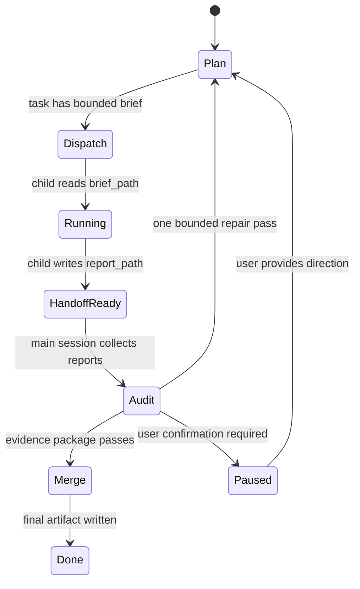

# Agent Pi Bounded Autonomy Design

Status: V2.0.1 MVP implemented, V2.1 design target.

## 1. Problem

V2.0 introduced Plan/Audit/Merge, task board state, entropy signals, selected-source hard boundaries, and sub-agent lifecycle records. Field testing showed one remaining failure mode: complex document tasks can still drift when a sub-agent receives too much parent context, or when Goal Audit reconstructs the run by scanning conversation history and the working directory.

The bounded-autonomy direction is to make every autonomous step file-backed and narrow:

- the main session owns the task board and final merge;
- sub-agents receive a small brief file, allowed sources, and a report path;
- evidence packages summarize the run for audit;
- a progress ledger exposes the current task, completed work, blocked items, user-confirmation needs, and entropy warnings.

## 2. V2.0.1 MVP

Implemented as a small step:

- `orchestration/briefs/`
- `orchestration/reports/`
- `orchestration/evidence-packages/`
- `orchestration/progress-ledger.json`

Sub-agent dispatch now externalizes the full prompt into a brief file. The child prompt contains only:

- `brief_path`
- `allowed_sources`
- `report_path`
- `evidence_packages_path`

Goal Audit writes an `orchestration_evidence_package` before model review and includes that path in audit evidence. The Info popover now has a ledger row with current task, completed count, blocked/review state, user-confirmation state, and evidence package path.

## 3. V2.1 Data Structures

### Orchestration State

```ts
interface SessionOrchestrationState {
  version: 1
  phase: 'plan' | 'audit' | 'merge' | 'paused'
  policy: SessionOrchestrationPolicy
  taskBoard: { tasks: SessionOrchestrationTask[] }
  subAgents: SessionSubAgentLifecycleEntry[]
  artifacts?: SessionOrchestrationArtifactPaths
  ledger?: SessionOrchestrationProgressLedger
  entropy?: SessionOrchestrationEntropySignal
}
```

### Artifact Paths

```ts
interface SessionOrchestrationArtifactPaths {
  rootPath: string
  briefsPath: string
  reportsPath: string
  evidencePackagesPath: string
  progressLedgerPath: string
}
```

### Progress Ledger

```ts
interface SessionOrchestrationProgressLedger {
  currentTaskId?: string
  pending: number
  running: number
  handoffReady: number
  completed: number
  needsReview: number
  blocked: number
  cancelled: number
  needsUserConfirmation: boolean
  evidencePackagePath?: string
  updatedAt: number
}
```

### Sub-Agent Brief

The brief is Markdown for readability and tool compatibility:

```md
# Spawned Agent Brief

task_id: chapter-1-agent
allowed_sources: file-memory-chapter-1
report_path: .../orchestration/reports/chapter-1-agent.md

## Scope
Only analyze selected COTO Chapter 1.

## Forbidden Actions
- Do not scan the working directory.
- Do not use unselected sources.
- Do not spawn child sessions.
- Do not write final synthesis artifacts.

## Required Handoff
- task_id: ...
- sources_used: ...
- evidence: ...
- artifacts: ...
- gaps: ...
- recommendation: ...
```

### Evidence Package

Evidence packages are compact JSON:

```json
{
  "version": 1,
  "goalId": "...",
  "iteration": 1,
  "objective": "...",
  "selectedSourceSlugs": ["file-memory-chapter-1"],
  "taskBoard": { "tasks": [] },
  "ledger": {},
  "audit": {
    "status": "fail",
    "summary": "...",
    "missingCriteria": [],
    "evidence": []
  },
  "recentMessages": []
}
```

## 4. Runtime State Machine



Rules:

- Only the main session can expand scope, add sources, or write final synthesis artifacts.
- A spawned session cannot spawn another session.
- If a brief is too large or ambiguous, the sub-agent writes gaps and recommendations to `report_path` instead of branching.
- Audit uses evidence packages and report paths first; conversation/workspace reconstruction is fallback only.

## 5. UI

V2.0.1 adds a compact ledger row in the Info popover:

- current task
- completed task count
- running/blocked/review count
- needs user confirmation
- evidence package path
- entropy warning

V2.1 UI should add:

- task-board table with filter by status;
- click-to-open brief/report/evidence package;
- user-confirmation queue with explicit approve/reject/adjust actions;
- entropy timeline showing why orchestration was narrowed or paused.

## 6. Tests

MVP tests added:

- shared orchestration builds artifact paths and ledger counts;
- spawned prompt only exposes brief/report/source paths when bounded dispatch is available;
- Goal Audit writes evidence package before reviewer evaluation;
- renderer view model exposes ledger summary.

V2.1 regression set:

- selected-source task cannot call broad working-directory discovery;
- child session prompt must not contain the full parent prompt when a brief exists;
- child session cannot spawn another child;
- audit cannot pass when report path is missing;
- audit cannot pass when evidence package contradicts final response;
- paused user-confirmation block must stop Goal Loop continuation;
- entropy threshold must pause or narrow instead of adding more sub-agents;
- final merge must cite report paths and selected evidence packages.

## 7. Phased Implementation

### Phase 1: Harden MVP

- Persist ledger updates on every task status transition.
- Mark sub-agent reports as `handoff_ready` only after the file exists.
- Add a repair pass that targets only failed task IDs.

### Phase 2: Evidence-First Audit

- Add a report/evidence package reader for Goal Audit.
- Limit audit context to package summaries plus selected file previews.
- Make conversation/workspace scan an explicit fallback with an audit warning.

### Phase 3: UI Control Surface

- Add task-board detail drawer.
- Add brief/report/evidence preview links.
- Add explicit user-confirmation actions.

### Phase 4: Bounded Multi-Agent Policy

- Add per-mode limits for sub-agent count, source count, context pressure, and repair passes.
- Add entropy-triggered pause and user confirmation.
- Add strict handoff schema validation before final merge.

### Phase 5: Domain Regression Packs

- Build IWG-style regression tasks for engineering tender, BOQ pricing, investment analysis, knowledge-base-only analysis, and long Markdown generation.
- Each pack should include selected sources, forbidden scope, expected reports, and failure cases.

## 8. Non-Goals

- Do not add a general autonomous planner that can recursively create agents.
- Do not make working-directory scan a default source.
- Do not replace Goal Loop; narrow and strengthen its evidence path.
- Do not require users to manage orchestration files manually.
